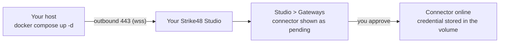

# Pick Connector - Docker Install Guide

Run the Pick connector as a single Docker container on a host inside your
network, connect it outbound to your Strike48 Studio, and approve it in Studio.
Install takes about ten minutes on a host that already has Docker.

The install, approval, restart, and removal steps in this guide were executed
against a live Strike48 Studio with the `0.1.10` image, and the log lines shown
are what that run printed. The proxy and private-CA sections describe behaviour
read from the connector's source and were not exercised against an appliance.
The network requirements, host networking, and Docker Desktop on Windows
sections describe Docker's documented behaviour and the connector's source;
they were not exercised in that run. The files this guide refers to live in this repository under
[`deploy/docker/`](../deploy/docker/).

## What you are installing

The connector is one container built on Kali Linux that bundles the
penetration-testing toolchain (nmap, nikto, nuclei, ffuf, sqlmap, and more) and
the `pentest-agent` binary. It opens one outbound TLS connection to your Studio
on port 443 and keeps it alive. At start and on each credential refresh it also
makes a short HTTPS call to your Strike48 authentication host, on 443. Nothing
dials in to you.

Because the connection is outbound only, you do not open a firewall port,
publish a hostname, or place the container in a DMZ. The host needs Docker and
egress to two hostnames on 443: your Studio and your authentication host.

On first start the connector registers with your tenant in a pending state and
carries no authority until someone with Gateways permission in your Studio
approves it. Strike48 staff cannot approve it for you.



## Before you begin

On the host that will run the connector:

| Requirement | Minimum | How to check |
| --- | --- | --- |
| Docker Engine | a current release (this guide was tested with 29.5) | `docker --version` |
| Docker Compose | v2 plugin (`docker compose`, not the 1.x `docker-compose`; tested with 5.5) | `docker compose version` |
| Outbound HTTPS to Studio | 443 to your Studio hostname | `curl -sS -o /dev/null -w '%{http_code}\n' https://<your-studio-host>/` prints `302` or `200` |
| Outbound HTTPS to authentication | 443 to your Strike48 authentication hostname | `curl -sS -o /dev/null -w '%{http_code}\n' https://<your-auth-host>/` prints a 2xx or 3xx code |
| Outbound HTTPS to the image registry | 443 to `ghcr.io` and `pkg-containers.githubusercontent.com`, which serves the image layers | `docker pull ghcr.io/strike48-public/pick:0.1.10` |
| Outbound HTTPS to GitHub releases, install time only | 443 to `github.com` and `release-assets.githubusercontent.com`, which the release download redirects to | the `curl` commands in step 1 succeed |
| Disk | 3 GB free | `df -h /var/lib/docker` (the image is about 1.2 GB unpacked) |
| Privileges | member of the `docker` group, or root | `docker ps` |
| Architecture | linux/amd64 or linux/arm64 | `uname -m` |
| Local-network discovery | a Linux host running Docker Engine. Docker Desktop on Windows or macOS supports TCP connect scans of routed hosts only; see [Docker Desktop on Windows](#docker-desktop-on-windows) | `uname -s` on the host prints `Linux`. On Windows or macOS, Docker runs in a virtual machine whichever product you use (Docker Desktop, Colima, and others), with similar network limits |

The host does not need a public IP, an inbound DNS record, or a certificate of
its own. If your egress goes through an HTTP proxy or a TLS-inspecting
appliance, read [Corporate proxy and private CA](#corporate-proxy-and-private-ca)
before you start.

### Network requirements for scanning

The table above covers what the connector needs to reach Studio. Scanning has
separate requirements, and they are all properties of the Docker host: the
container reaches your targets through the host's network and resolves names
through the host's DNS configuration. If the host cannot reach or resolve a
target, neither can Pick. Check these on the host before you install.

1. **The host is on the network you want to scan.** Connect it to the VLAN or
   segment in scope, and confirm it can reach a known-live target:

   ```bash
   nc -vz -w3 <known-live-ip> <open-port>
   ```

   If `nc` is not installed, bash can make the same check:

   ```bash
   timeout 3 bash -c '</dev/tcp/<known-live-ip>/<open-port>' && echo open
   ```

2. **The host resolves your internal names.** On the default network, Docker's
   embedded DNS server (`127.0.0.11` inside the container) forwards lookups to
   the DNS servers configured on the host. With
   [host networking](#enable-host-networking) the container shares the host's
   network stack. In both cases a host that points only at a public resolver
   cannot resolve internal names, and scans of those names fail. The
   in-container check at the end of this section confirms what the container
   actually resolves. On the host, confirm with an internal hostname:

   ```bash
   getent hosts <internal-hostname>
   ```

   If this fails, fix the host's DNS first (your DHCP, netplan, or
   systemd-resolved configuration). If the host must keep a different
   resolver, give the container your internal DNS servers in
   `docker-compose.override.yml`:

   ```yaml
   services:
     pick:
       dns:
         - <internal-dns-server-ip>
       dns_search:
         - <internal.example.com>
   ```

3. **Docker uses the network mode your scans need.** The default bridge network
   is enough for TCP and UDP scans of routed hosts. mDNS, SSDP, ARP discovery,
   packet capture, and Wi-Fi scanning need host networking on a Linux host. See
   [Scanning your local network](#scanning-your-local-network-host-networking)
   to choose.

   | Scan type | Default bridge | Host networking (Linux) |
   | --- | --- | --- |
   | TCP/UDP port scans of routed hosts | yes, if the bridge subnet does not overlap your LAN | yes |
   | ICMP ping sweeps | yes | yes |
   | mDNS/Bonjour, SSDP/UPnP discovery | no | yes |
   | ARP discovery, packet capture, Wi-Fi scanning | no | yes |

After the connector is running, repeat the checks from inside the container to
confirm it sees what the host sees:

```bash
docker exec pick-connector getent hosts <internal-hostname>
docker exec pick-connector nc -vz -w3 <known-live-ip> <open-port>
```

A check that works on the host but fails in the container points at the
network mode, a subnet overlap, or the container's DNS settings.

### What Strike48 gives you

1. Your **Studio URL**, for example `https://studio.example.com`. The connector
   uses the same hostname you open in a browser.
2. Your **authentication hostname**, for example `auth.example.com`. You do not
   configure it anywhere; Studio hands it to the connector at approval. You need
   it only to allow egress.
3. Your **tenant UUID**, a value shaped like `0192a7c4-3f5e-7b21-9d4a-6e8f0c1b2a3d`.
   It is an identifier rather than a secret, but treat it as internal.
4. Optionally, a **registration token** (`ott_...`) if you want the connector
   pre-approved instead of approving it by hand. Tokens are single-use and
   expire fifteen minutes after they are issued.

There is no registry login. The image is public.

## Install

### 1. Get the bundle

Two files: a compose file you do not edit and an environment template you copy.
Both ship as assets of the release you are installing, so the bundle, this
guide, and the image are pinned to the same version. `0.1.10` is the release
approved for customer use.

```bash
PICK_VERSION=0.1.10
mkdir pick-connector && cd pick-connector
curl -fsSL "https://github.com/Strike48-public/pick/releases/download/v${PICK_VERSION}/pick-docker-compose.yml" -o docker-compose.yml
curl -fsSL "https://github.com/Strike48-public/pick/releases/download/v${PICK_VERSION}/pick-docker.env.example" -o .env.example
```

The compose file from a release defaults to that release's image tag, so you
do not set the tag anywhere. The source of both files is
[`deploy/docker/`](../deploy/docker/) in this repository; the release copy of
the compose file differs only in that default.

### 2. Configure

```bash
cp .env.example .env
$EDITOR .env
```

Fill in the four required values. Everything else in the file is optional and
stays commented out unless you need it.

```bash
STRIKE48_HOST=wss://studio.example.com
STRIKE48_API_URL=https://studio.example.com/
STRIKE48_TENANT=<your tenant UUID>
STRIKE48_INSTANCE_ID=pick-<hostname>-01
```

`STRIKE48_HOST` is your Studio hostname with `wss://` in place of `https://`
and no port. `STRIKE48_API_URL` is the same hostname over `https://` with a
trailing slash. `STRIKE48_INSTANCE_ID` is any stable name for this install; the
approval is keyed to it, so pick something you will not change.

**Use a different `STRIKE48_INSTANCE_ID` on every machine.** If you install on
more than one machine, for example a laptop and a lab server, do not copy the
same `.env` between them unchanged. Two connectors with the same instance id
compete for one identity in Studio, and Studio can show the connector as
offline or fail to open its app.

### 3. Start

```bash
docker compose up -d
```

The first start pulls the image, which takes a minute or two. A missing
required value aborts immediately with a message naming it, for example:

```
error while interpolating services.pick.environment.STRIKE48_TENANT:
required variable STRIKE48_TENANT is missing a value: set STRIKE48_TENANT in .env to your tenant UUID
```

### 4. Check the logs

```bash
docker compose logs --no-color
```

A successful first start ends with these lines. The instance name and tenant
are yours:

```
pentest-agent starting
  host:      wss://studio.example.com
  tenant:    0192a7c4-3f5e-7b21-9d4a-6e8f0c1b2a3d
  instance:  pick-dc1-01
  tls:       true
  auth:      ott (pending approval)
Registered 116 tools
Registering without JWT (pending approval flow)
Registered successfully: matrix:0192a7c4-3f5e-7b21-9d4a-6e8f0c1b2a3d:pentest-connector:pick-dc1-01
[status] Registered
```

`Registered` here means the connector has announced itself and is waiting. It
is not approved yet and cannot run tools.

### 5. Approve in Studio

Open your Studio and go to **Gateways**. The connector appears as a pending
entry identified by the instance id you set in `.env`. Confirm the id matches,
then approve it.

### 6. Confirm

Approval reaches the connector over the connection it already holds. Within a
few seconds the log shows:

```
Sent JWT re-registration on existing stream (no disconnect)
Registered successfully: matrix:0192a7c4-3f5e-7b21-9d4a-6e8f0c1b2a3d:pentest-connector:pick-dc1-01
```

Check with:

```bash
docker compose logs --no-color --since 5m
```

The connector is online when Studio shows it as active. From this point the
approval persists across restarts, upgrades, and host reboots, because the
credential lives in the `pick-connector_pick-state` volume. After a restart the
startup banner still prints `auth: ott (pending approval)` before the stored
credential is loaded; the `Registering without JWT (pending approval flow)`
line no longer appears, and Studio keeps showing the connector as active.

## Configuration reference

All values are read from `.env`. The compose file passes the file through and
pins the security defaults, so a value you set in `.env` for a pinned variable
is ignored.

| Variable | Required | What it does |
| --- | --- | --- |
| `STRIKE48_HOST` | yes | Studio WebSocket endpoint, `wss://<host>`. |
| `STRIKE48_API_URL` | yes | Studio HTTPS origin with trailing slash. The connector posts its registration here, overriding any callback address the Studio advertises. |
| `STRIKE48_TENANT` | yes | Your tenant UUID. |
| `STRIKE48_INSTANCE_ID` | yes | Stable identity of this install. Approval is keyed to `CONNECTOR_NAME` plus this value. |
| `CONNECTOR_NAME` | no | Gateway name shown in Studio. Default `pentest-connector`. Instances sharing a name are load-balanced as one gateway. |
| `PICK_IMAGE_TAG` | no | Image tag. Defaults to the release the compose file was downloaded from. Leave it unset so bundle and image stay one set. |
| `STRIKE48_REGISTRATION_TOKEN` | no | Pre-approval token. See [Pre-approval](#pre-approval-with-a-registration-token). Never leave it set to an empty value. |
| `HTTPS_PROXY`, `NO_PROXY` | no | Standard proxy variables, HTTP CONNECT. Lowercase spellings work too. |
| `MATRIX_TLS_CA_CERT` | no | Path inside the container to an extra CA certificate in PEM format. Added to the system roots. |
| `PENTEST_ALLOW_PRIVATE_IPS` | no | `true` lets tools target RFC 1918 and loopback addresses. See [Scanning private address ranges](#scanning-private-address-ranges). |
| `RUST_LOG` | no | Log filter. Default `info,strike48_connector=info`. |

Pinned by the compose file and not configurable from `.env`:

| Variable | Pinned to | Why |
| --- | --- | --- |
| `DISABLE_SANDBOX` | `true` | The image does not ship the in-container tool sandbox; the container is the isolation boundary. |
| `MATRIX_TLS_INSECURE` | `false` | Certificate verification stays on. Use `MATRIX_TLS_CA_CERT` for a private CA. |

## Day-to-day operations

Logs, following, with timestamps:

```bash
docker compose logs -f --timestamps
```

Restart:

```bash
docker compose restart
```

Upgrade to a newer approved release by fetching that release's compose file,
which carries the new image tag as its default. Approval survives because the
volume does:

```bash
PICK_VERSION=<new version>
curl -fsSL "https://github.com/Strike48-public/pick/releases/download/v${PICK_VERSION}/pick-docker-compose.yml" -o docker-compose.yml
docker compose pull
docker compose up -d
```

Setting `PICK_IMAGE_TAG` in `.env` also works, but then the compose file and
the image are no longer from the same release.

Stop without losing the approval:

```bash
docker compose down
```

Remove completely. The `-v` flag deletes the volume holding the credential, so
the gateway in Studio becomes an orphan; remove it there as well.

```bash
docker compose down -v
```

Move to another host: install on the new host with the same `.env`. The
credential stays in the old host's volume, so the connector registers as
pending again and needs a fresh approval. Remove the old host's container first
so two connectors do not share one instance id.

## Pre-approval with a registration token

If Strike48 or your Studio administrator issues you a registration token
(`ott_...`), the connector approves itself on first start and no one has to
visit Gateways.

1. Uncomment `STRIKE48_REGISTRATION_TOKEN` in `.env` and paste the token.
2. Run `docker compose up -d` within fifteen minutes of the token being issued.
3. After the connector is online, comment the line out again. The token is
   spent; leaving it in place does no harm but leaving the variable set to an
   empty value does, because the connector treats an empty token as a token.

## Corporate proxy and private CA

**HTTP proxy.** Uncomment `HTTPS_PROXY` in `.env` and set your proxy URL. The
connector tunnels the WebSocket and its HTTPS calls through an HTTP CONNECT
proxy and honours `NO_PROXY`. Docker itself also needs the proxy for the image
pull; configure that in the Docker daemon or the client config as your
organisation normally does.

**TLS-inspecting appliance or private CA.** Do not disable certificate
verification. Instead, give the connector your CA:

1. Put the CA certificate in PEM format next to the compose file, for example
   `corp-ca.pem`.
2. Create `docker-compose.override.yml` beside `docker-compose.yml`:

   ```yaml
   services:
     pick:
       volumes:
         - ./corp-ca.pem:/etc/pick/corp-ca.pem:ro
   ```

3. Uncomment `MATRIX_TLS_CA_CERT=/etc/pick/corp-ca.pem` in `.env`.
4. `docker compose up -d`.

Compose merges the override automatically. The CA is added to the trust store
the connector already uses, not substituted for it.

## Scanning private address ranges

The connector refuses to point its web tools at RFC 1918, loopback, and
link-local addresses by default. This is deliberate SSRF protection. An
on-premises engagement whose scope includes `10.0.0.0/8`, `172.16.0.0/12`, or
`192.168.0.0/16` needs it relaxed:

```bash
PENTEST_ALLOW_PRIVATE_IPS=true
```

Treat that change as a scope decision recorded in your rules of engagement, not
a troubleshooting step. The cloud-metadata range `169.254.0.0/16` stays blocked
regardless.

## Scanning your local network (host networking)

By default the compose file puts the container on a Docker bridge network that
Compose creates for it, named `pick-connector_default`. The container gets its
own internal subnet and reaches your network through Docker's NAT. That is
enough for the Studio connection and for TCP scans of routed hosts, but it
limits local-network discovery:

- **Multicast discovery returns nothing.** mDNS/Bonjour (`_ipp._tcp.local.`
  and similar) and SSDP/UPnP use multicast, which does not cross the bridge. On
  a bridge network these scans come back empty on every network.
- **Layer 2 discovery and Wi-Fi tools see only the container.** ARP-based host
  discovery, packet capture, and Wi-Fi scanning see the container's virtual
  interface, not the host's Ethernet or wireless adapters.
- **A subnet overlap hides targets.** If Docker assigned the bridge a range
  that overlaps your LAN (Docker's default pools draw from `172.16.0.0/12` and
  `192.168.0.0/16`, and many organisations configure `10.x` pools), traffic to
  those targets stays inside the container and every host looks down.

To check which network the container is on and what subnet it was given:

```bash
docker inspect pick-connector --format '{{.HostConfig.NetworkMode}}'
docker network inspect pick-connector_default --format '{{range .IPAM.Config}}{{.Subnet}}{{end}}'
```

### Enable host networking

Host networking puts the container on the host's own network stack, so tools
use the host's interfaces directly. This is the Compose equivalent of
`docker run --network=host`.

1. Create `docker-compose.override.yml` beside `docker-compose.yml`. If you
   already have one (for example for a private CA), add the `network_mode`
   line to the existing `pick` service instead.

   ```yaml
   services:
     pick:
       network_mode: host
   ```

2. Recreate the container:

   ```bash
   docker compose up -d
   ```

3. Confirm the mode:

   ```bash
   docker inspect pick-connector --format '{{.HostConfig.NetworkMode}}'
   ```

   This prints `host`.

The approval is stored in the `pick-connector_pick-state` volume, so the
connector comes back online without a new approval. The `NET_RAW` and
`NET_ADMIN` capabilities in the compose file still apply and are still needed
for raw-socket tools.

### Before you enable it

- **Use a Linux host running Docker Engine.** On Docker Desktop for macOS or
  Windows, containers run inside a virtual machine. Docker Desktop 4.34 and
  later offers host networking as an opt-in setting, but Docker documents it as
  layer 4 only: TCP and UDP work, and protocols below them do not. ICMP, ARP,
  raw-socket scans, and Wi-Fi tools therefore still cannot reach your network
  from Docker Desktop. On a laptop, run the Pick desktop app natively instead.
- **Use a dedicated scanning host.** Host networking removes the network
  isolation between the connector and the host. The connector's internal
  model proxy listens on a loopback TCP port, which is then on the host's
  loopback interface, where other local processes can reach it. Run it on a
  host that only runs the connector.
- **Scope still applies.** Host networking gives the tools reach to every
  network the host can see. Keep targets to the scope recorded in your rules of
  engagement.

If you only need TCP scans and the problem is a subnet overlap, you can keep
the bridge instead: set `default-address-pools` in the Docker daemon
configuration (`/etc/docker/daemon.json`) to a range your network does not use,
for example:

```json
{
  "default-address-pools": [
    { "base": "172.30.0.0/16", "size": 24 }
  ]
}
```

The daemon reads this setting only at start, so restart it, then recreate the
connector's network:

```bash
sudo systemctl restart docker
docker compose down
docker compose up -d
```

Restarting the daemon stops every container on the host, so schedule it. The
`pick-connector_pick-state` volume survives `docker compose down`, so the
approval is kept. Check the new subnet with the `docker network inspect` command above.

## Docker Desktop on Windows

The connector runs on Docker Desktop for Windows, with less network reach than
on a Linux host. Docker Desktop runs Linux containers inside a WSL 2 virtual
machine, and Docker documents that all of that VM's network traffic goes
through NAT in Docker Desktop's backend process (`com.docker.backend`). The
container never sits directly on your LAN, and the
[host networking](#enable-host-networking) option does not change that on
Docker Desktop.

### What works and what does not

| Scan type | Docker Desktop on Windows |
| --- | --- |
| Connection to Studio, approval, tools that talk to the internet | works |
| TCP connect scans of hosts your laptop can route to | works, subject to Windows firewall and VPN rules |
| ICMP ping sweeps, raw-socket (SYN) scans | not documented by Docker; treat results as unreliable |
| mDNS/Bonjour, SSDP/UPnP, ARP discovery, packet capture, Wi-Fi scanning | does not work |

If you need local discovery from a Windows laptop, use the native Pick app for
Windows from the
[releases page](https://github.com/Strike48-public/pick/releases) instead of
Docker. It runs on the laptop's own network interfaces rather than behind
Docker's NAT; packet capture in it needs [Npcap](https://npcap.com/) installed.
For the full discovery toolset, run the connector on a Linux host on the
network you are scanning.

### Requirements

- Docker Desktop with the WSL 2 backend, running **Linux containers** (the
  default). The image is a Linux image and does not run in Windows containers
  mode.
- Windows Defender Firewall, or your endpoint security agent, must allow
  outbound traffic from `com.docker.backend`. Docker notes that host firewalls
  filter Docker Desktop traffic on that process.
- If you are on a VPN, your laptop may reach Studio but not the network you
  are scanning, or the other way round. Check both before you start.

### Install from PowerShell

The install steps above are written for a Linux shell. In PowerShell, use
these equivalents. Use `curl.exe`, not `curl`: in Windows PowerShell 5.1,
`curl` is an alias for `Invoke-WebRequest` and rejects the flags below.

```powershell
$PICK_VERSION = "0.1.10"
mkdir pick-connector; cd pick-connector
curl.exe -fsSL "https://github.com/Strike48-public/pick/releases/download/v$PICK_VERSION/pick-docker-compose.yml" -o docker-compose.yml
curl.exe -fsSL "https://github.com/Strike48-public/pick/releases/download/v$PICK_VERSION/pick-docker.env.example" -o .env.example
Copy-Item .env.example .env
notepad .env
```

In Notepad, fill in the required values and save. Make sure the file is still
named `.env`, not `.env.txt`, and save it as UTF-8 rather than "UTF-8 with
BOM". Then continue with [3. Start](#3-start); the `docker compose` and
`docker exec` commands are the same in PowerShell.

### Check your network from Windows

Run these on the laptop before you install:

```powershell
Test-NetConnection <known-live-ip> -Port <open-port>
Resolve-DnsName <internal-hostname>
```

`TcpTestSucceeded : True` means the laptop can reach the target, and a
returned address means it resolves the name. After the connector is running,
repeat the checks inside the container:

```powershell
docker exec pick-connector nc -vz -w3 <known-live-ip> <open-port>
docker exec pick-connector getent hosts <internal-hostname>
```

If the laptop check passes but the container check fails, the cause is
Docker Desktop's network path: the firewall rule for `com.docker.backend`, the
VPN, or, for names, DNS. For DNS, set your internal DNS servers with the
`dns:` override shown in
[Network requirements for scanning](#network-requirements-for-scanning).

## Troubleshooting

| Symptom | Likely cause | Fix |
| --- | --- | --- |
| `required variable ... is missing a value` at `up` | A required line in `.env` is blank or still commented out | Fill it in and run `docker compose up -d` again |
| `Connecting to wss://...` repeats with connection errors | Egress to the Studio host on 443 is blocked, or a proxy is required | Allow outbound 443 to the Studio hostname; set `HTTPS_PROXY` |
| Approved in Studio, but the connector never comes online after a restart | Egress to the authentication host on 443 is blocked | Allow outbound 443 to the authentication hostname Strike48 gave you |
| `Invalid host URL` at startup | `STRIKE48_HOST` points at a private IP or hostname that resolves to one | Use the public Studio hostname. For a private Studio, set `PENTEST_ALLOW_PRIVATE_IPS=true` |
| Connection fails with a port in `STRIKE48_HOST` | Hosted Studios are reached on 443 only; a port copied from a development setup will not answer | Remove the port from `STRIKE48_HOST` |
| TLS or certificate errors in the log | A TLS-inspecting appliance re-signs traffic | Follow [Corporate proxy and private CA](#corporate-proxy-and-private-ca). Do not set `MATRIX_TLS_INSECURE` |
| Logs say `Registered successfully` but nothing appears in Gateways | Wrong `STRIKE48_TENANT`, so it registered against another tenant | Confirm the UUID with Strike48, fix `.env`, `docker compose down -v`, `docker compose up -d` |
| Registration fails right after start with a token in `.env` | The token expired, was already used, or the line is set but empty | Get a fresh token or comment the line out and approve by hand |
| `PENTEST_ALLOW_PRIVATE_IPS is set to an unrecognized value` warning | The variable is set to something other than `true` or `1` | Set it to `true` or comment it out |
| mDNS, SSDP, ARP, or Wi-Fi scans return nothing | The container is on the default bridge network, which multicast and layer 2 traffic do not cross | [Enable host networking](#enable-host-networking) on a Linux host |
| Every host in a known-live range looks down, including TCP ports you know are open | The bridge subnet overlaps your LAN, or Docker Desktop cannot reach the local network | Check the subnet as shown in [Scanning your local network](#scanning-your-local-network-host-networking); change the Docker address pool or enable host networking |
| Scans of internal hostnames fail but the same targets work by IP | The host's DNS does not resolve internal names, so the container cannot either | Fix the host's DNS, or set `dns:` in an override. See [Network requirements for scanning](#network-requirements-for-scanning) |
| The agent reports no live hosts on a network you know is up, or says a firewall is dropping ICMP | The container cannot reach or resolve the targets: wrong network mode, a subnet overlap, host DNS, or Docker Desktop's network limits. A scan that only times out is not evidence of a firewall | Run the host and in-container checks in [Network requirements for scanning](#network-requirements-for-scanning). On Windows, see [Docker Desktop on Windows](#docker-desktop-on-windows) |
| Studio shows `App not found or connector is offline` when you open the connector | The connector is not approved or not connected, or two installs share one `STRIKE48_INSTANCE_ID` | Check the Gateways page for the connector's state and for duplicate entries. Give each machine its own `STRIKE48_INSTANCE_ID`, restart it, and approve the new entry |
| Pending for a long time | Nobody has approved it | Expected. Someone with Gateways permission in your Studio must approve |
| Container restarts in a loop | Malformed `.env` | `docker compose logs`, fix, `docker compose up -d` |

When contacting Strike48 support, include the output of `docker compose ps`
and the last fifty log lines. Redact your tenant UUID if you are sending over
an untrusted channel.

## Security notes

- The container runs as root with the `NET_RAW` and `NET_ADMIN` capabilities so
  that nmap and similar tools can open raw sockets. It has no published ports.
  With [host networking](#enable-host-networking) enabled it shares the host's
  network stack instead of an isolated bridge.
- The connector holds no long-lived bearer token. At approval it stores a
  client identity and a private key in the `pick-connector_pick-state` volume,
  under `/root/.strike48/credentials/` and `/root/.strike48/keys/`, both mode
  0600. At every start it signs a short assertion with that key and exchanges
  it at your authentication host for a short-lived JWT. Back that volume up if
  you want to survive a host rebuild without re-approval.
- `.env` contains no secret unless you add a registration token. Comment the
  token out once the connector is online.
- The connector posts its registration only to the origin in
  `STRIKE48_API_URL`. If the Studio advertises a different callback address,
  the connector logs the override and uses yours.

## Getting help

- Strike48 support: your Strike48 contact.
- Repository: https://github.com/Strike48-public/pick
