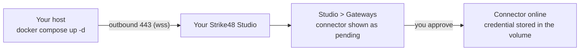

# Pick Connector - Docker Install Guide

Run the Pick connector as a single Docker container on a host inside your
network, connect it outbound to your Strike48 Studio, and approve it in Studio.
Install takes about ten minutes on a host that already has Docker.

The install, approval, restart, and removal steps in this guide were executed
against a live Strike48 Studio with the `0.1.10` image, and the log lines shown
are what that run printed. The proxy and private-CA sections describe behaviour
read from the connector's source and were not exercised against an appliance.
The files this guide refers to live in this repository under
[`deploy/docker/`](../deploy/docker/).

## What you are installing

The connector is one container built on Kali Linux that bundles the
penetration-testing toolchain (nmap, nikto, nuclei, ffuf, sqlmap, and more) and
the `pentest-agent` binary. It opens one outbound TLS connection to your Studio
on port 443 and keeps it alive. At start and on each credential refresh it also
makes a short HTTPS call to your Strike48 authentication host, on 443. Nothing
dials in to you.

Because the connection is outbound only, you do not open a firewall port,
publish a hostname, or place the container in a DMZ. The host needs Docker and
egress to two hostnames on 443: your Studio and your authentication host.

On first start the connector registers with your tenant in a pending state and
carries no authority until someone with Gateways permission in your Studio
approves it. Strike48 staff cannot approve it for you.



## Before you begin

On the host that will run the connector:

| Requirement | Minimum | How to check |
| --- | --- | --- |
| Docker Engine | a current release (this guide was tested with 29.5) | `docker --version` |
| Docker Compose | v2 plugin (`docker compose`, not the 1.x `docker-compose`; tested with 5.5) | `docker compose version` |
| Outbound HTTPS to Studio | 443 to your Studio hostname | `curl -sS -o /dev/null -w '%{http_code}\n' https://<your-studio-host>/` prints `302` or `200` |
| Outbound HTTPS to authentication | 443 to your Strike48 authentication hostname | `curl -sS -o /dev/null -w '%{http_code}\n' https://<your-auth-host>/` prints a 2xx or 3xx code |
| Outbound HTTPS to the image registry | 443 to `ghcr.io` and `pkg-containers.githubusercontent.com`, which serves the image layers | `docker pull ghcr.io/strike48-public/pick:0.1.10` |
| Disk | 3 GB free | `df -h /var/lib/docker` (the image is about 1.2 GB unpacked) |
| Privileges | member of the `docker` group, or root | `docker ps` |
| Architecture | linux/amd64 or linux/arm64 | `uname -m` |

The host does not need a public IP, an inbound DNS record, or a certificate of
its own. If your egress goes through an HTTP proxy or a TLS-inspecting
appliance, read [Corporate proxy and private CA](#corporate-proxy-and-private-ca)
before you start.

### What Strike48 gives you

1. Your **Studio URL**, for example `https://studio.example.com`. The connector
   uses the same hostname you open in a browser.
2. Your **authentication hostname**, for example `auth.example.com`. You do not
   configure it anywhere; Studio hands it to the connector at approval. You need
   it only to allow egress.
3. Your **tenant UUID**, a value shaped like `0192a7c4-3f5e-7b21-9d4a-6e8f0c1b2a3d`.
   It is an identifier rather than a secret, but treat it as internal.
4. Optionally, a **registration token** (`ott_...`) if you want the connector
   pre-approved instead of approving it by hand. Tokens are single-use and
   expire fifteen minutes after they are issued.

There is no registry login. The image is public.

## Install

### 1. Get the bundle

Two files: a compose file you do not edit and an environment template you copy.

```bash
mkdir pick-connector && cd pick-connector
curl -fsSLO https://raw.githubusercontent.com/Strike48-public/pick/main/deploy/docker/docker-compose.yml
curl -fsSLO https://raw.githubusercontent.com/Strike48-public/pick/main/deploy/docker/.env.example
```

If you prefer, clone the repository and work in `deploy/docker/`. The two files
are identical either way.

### 2. Configure

```bash
cp .env.example .env
$EDITOR .env
```

Fill in the four required values. Everything else in the file is optional and
stays commented out unless you need it.

```bash
STRIKE48_HOST=wss://studio.example.com
STRIKE48_API_URL=https://studio.example.com/
STRIKE48_TENANT=<your tenant UUID>
STRIKE48_INSTANCE_ID=pick-<hostname>-01
```

`STRIKE48_HOST` is your Studio hostname with `wss://` in place of `https://`
and no port. `STRIKE48_API_URL` is the same hostname over `https://` with a
trailing slash. `STRIKE48_INSTANCE_ID` is any stable name for this install; the
approval is keyed to it, so pick something you will not change.

### 3. Start

```bash
docker compose up -d
```

The first start pulls the image, which takes a minute or two. A missing
required value aborts immediately with a message naming it, for example:

```
error while interpolating services.pick.environment.STRIKE48_TENANT:
required variable STRIKE48_TENANT is missing a value: set STRIKE48_TENANT in .env to your tenant UUID
```

### 4. Check the logs

```bash
docker compose logs --no-color
```

A successful first start ends with these lines. The instance name and tenant
are yours:

```
pentest-agent starting
  host:      wss://studio.example.com
  tenant:    0192a7c4-3f5e-7b21-9d4a-6e8f0c1b2a3d
  instance:  pick-dc1-01
  tls:       true
  auth:      ott (pending approval)
Registered 116 tools
Registering without JWT (pending approval flow)
Registered successfully: matrix:0192a7c4-3f5e-7b21-9d4a-6e8f0c1b2a3d:pentest-connector:pick-dc1-01
[status] Registered
```

`Registered` here means the connector has announced itself and is waiting. It
is not approved yet and cannot run tools.

### 5. Approve in Studio

Open your Studio and go to **Gateways**. The connector appears as a pending
entry identified by the instance id you set in `.env`. Confirm the id matches,
then approve it.

### 6. Confirm

Approval reaches the connector over the connection it already holds. Within a
few seconds the log shows:

```
Sent JWT re-registration on existing stream (no disconnect)
Registered successfully: matrix:0192a7c4-3f5e-7b21-9d4a-6e8f0c1b2a3d:pentest-connector:pick-dc1-01
```

Check with:

```bash
docker compose logs --no-color --since 5m
```

The connector is online when Studio shows it as active. From this point the
approval persists across restarts, upgrades, and host reboots, because the
credential lives in the `pick-connector_pick-state` volume. After a restart the
startup banner still prints `auth: ott (pending approval)` before the stored
credential is loaded; the `Registering without JWT (pending approval flow)`
line no longer appears, and Studio keeps showing the connector as active.

## Configuration reference

All values are read from `.env`. The compose file passes the file through and
pins the security defaults, so a value you set in `.env` for a pinned variable
is ignored.

| Variable | Required | What it does |
| --- | --- | --- |
| `STRIKE48_HOST` | yes | Studio WebSocket endpoint, `wss://<host>`. |
| `STRIKE48_API_URL` | yes | Studio HTTPS origin with trailing slash. The connector posts its registration here, overriding any callback address the Studio advertises. |
| `STRIKE48_TENANT` | yes | Your tenant UUID. |
| `STRIKE48_INSTANCE_ID` | yes | Stable identity of this install. Approval is keyed to `CONNECTOR_NAME` plus this value. |
| `CONNECTOR_NAME` | no | Gateway name shown in Studio. Default `pentest-connector`. Instances sharing a name are load-balanced as one gateway. |
| `PICK_IMAGE_TAG` | no | Image tag. Default `0.1.10`, the release approved for customer use. |
| `STRIKE48_REGISTRATION_TOKEN` | no | Pre-approval token. See [Pre-approval](#pre-approval-with-a-registration-token). Never leave it set to an empty value. |
| `HTTPS_PROXY`, `NO_PROXY` | no | Standard proxy variables, HTTP CONNECT. Lowercase spellings work too. |
| `MATRIX_TLS_CA_CERT` | no | Path inside the container to an extra CA certificate in PEM format. Added to the system roots. |
| `PENTEST_ALLOW_PRIVATE_IPS` | no | `true` lets tools target RFC 1918 and loopback addresses. See [Scanning private address ranges](#scanning-private-address-ranges). |
| `RUST_LOG` | no | Log filter. Default `info,strike48_connector=info`. |

Pinned by the compose file and not configurable from `.env`:

| Variable | Pinned to | Why |
| --- | --- | --- |
| `DISABLE_SANDBOX` | `true` | The image does not ship the in-container tool sandbox; the container is the isolation boundary. |
| `MATRIX_TLS_INSECURE` | `false` | Certificate verification stays on. Use `MATRIX_TLS_CA_CERT` for a private CA. |

## Day-to-day operations

Logs, following, with timestamps:

```bash
docker compose logs -f --timestamps
```

Restart:

```bash
docker compose restart
```

Upgrade to a newer approved release. Approval survives because the volume does:

```bash
$EDITOR .env             # set PICK_IMAGE_TAG=<new tag>
docker compose pull
docker compose up -d
```

Stop without losing the approval:

```bash
docker compose down
```

Remove completely. The `-v` flag deletes the volume holding the credential, so
the gateway in Studio becomes an orphan; remove it there as well.

```bash
docker compose down -v
```

Move to another host: install on the new host with the same `.env`. The
credential stays in the old host's volume, so the connector registers as
pending again and needs a fresh approval. Remove the old host's container first
so two connectors do not share one instance id.

## Pre-approval with a registration token

If Strike48 or your Studio administrator issues you a registration token
(`ott_...`), the connector approves itself on first start and no one has to
visit Gateways.

1. Uncomment `STRIKE48_REGISTRATION_TOKEN` in `.env` and paste the token.
2. Run `docker compose up -d` within fifteen minutes of the token being issued.
3. After the connector is online, comment the line out again. The token is
   spent; leaving it in place does no harm but leaving the variable set to an
   empty value does, because the connector treats an empty token as a token.

## Corporate proxy and private CA

**HTTP proxy.** Uncomment `HTTPS_PROXY` in `.env` and set your proxy URL. The
connector tunnels the WebSocket and its HTTPS calls through an HTTP CONNECT
proxy and honours `NO_PROXY`. Docker itself also needs the proxy for the image
pull; configure that in the Docker daemon or the client config as your
organisation normally does.

**TLS-inspecting appliance or private CA.** Do not disable certificate
verification. Instead, give the connector your CA:

1. Put the CA certificate in PEM format next to the compose file, for example
   `corp-ca.pem`.
2. Create `docker-compose.override.yml` beside `docker-compose.yml`:

   ```yaml
   services:
     pick:
       volumes:
         - ./corp-ca.pem:/etc/pick/corp-ca.pem:ro
   ```

3. Uncomment `MATRIX_TLS_CA_CERT=/etc/pick/corp-ca.pem` in `.env`.
4. `docker compose up -d`.

Compose merges the override automatically. The CA is added to the trust store
the connector already uses, not substituted for it.

## Scanning private address ranges

The connector refuses to point its web tools at RFC 1918, loopback, and
link-local addresses by default. This is deliberate SSRF protection. An
on-premises engagement whose scope includes `10.0.0.0/8`, `172.16.0.0/12`, or
`192.168.0.0/16` needs it relaxed:

```bash
PENTEST_ALLOW_PRIVATE_IPS=true
```

Treat that change as a scope decision recorded in your rules of engagement, not
a troubleshooting step. The cloud-metadata range `169.254.0.0/16` stays blocked
regardless.

## Troubleshooting

| Symptom | Likely cause | Fix |
| --- | --- | --- |
| `required variable ... is missing a value` at `up` | A required line in `.env` is blank or still commented out | Fill it in and run `docker compose up -d` again |
| `Connecting to wss://...` repeats with connection errors | Egress to the Studio host on 443 is blocked, or a proxy is required | Allow outbound 443 to the Studio hostname; set `HTTPS_PROXY` |
| Approved in Studio, but the connector never comes online after a restart | Egress to the authentication host on 443 is blocked | Allow outbound 443 to the authentication hostname Strike48 gave you |
| `Invalid host URL` at startup | `STRIKE48_HOST` points at a private IP or hostname that resolves to one | Use the public Studio hostname. For a private Studio, set `PENTEST_ALLOW_PRIVATE_IPS=true` |
| Connection fails with a port in `STRIKE48_HOST` | Hosted Studios are reached on 443 only; a port copied from a development setup will not answer | Remove the port from `STRIKE48_HOST` |
| TLS or certificate errors in the log | A TLS-inspecting appliance re-signs traffic | Follow [Corporate proxy and private CA](#corporate-proxy-and-private-ca). Do not set `MATRIX_TLS_INSECURE` |
| Logs say `Registered successfully` but nothing appears in Gateways | Wrong `STRIKE48_TENANT`, so it registered against another tenant | Confirm the UUID with Strike48, fix `.env`, `docker compose down -v`, `docker compose up -d` |
| Registration fails right after start with a token in `.env` | The token expired, was already used, or the line is set but empty | Get a fresh token or comment the line out and approve by hand |
| `PENTEST_ALLOW_PRIVATE_IPS is set to an unrecognized value` warning | The variable is set to something other than `true` or `1` | Set it to `true` or comment it out |
| Pending for a long time | Nobody has approved it | Expected. Someone with Gateways permission in your Studio must approve |
| Container restarts in a loop | Malformed `.env` | `docker compose logs`, fix, `docker compose up -d` |

When contacting Strike48 support, include the output of `docker compose ps`
and the last fifty log lines. Redact your tenant UUID if you are sending over
an untrusted channel.

## Security notes

- The container runs as root with the `NET_RAW` and `NET_ADMIN` capabilities so
  that nmap and similar tools can open raw sockets. It has no published ports.
- The connector holds no long-lived bearer token. At approval it stores a
  client identity and a private key in the `pick-connector_pick-state` volume,
  under `/root/.strike48/credentials/` and `/root/.strike48/keys/`, both mode
  0600. At every start it signs a short assertion with that key and exchanges
  it at your authentication host for a short-lived JWT. Back that volume up if
  you want to survive a host rebuild without re-approval.
- `.env` contains no secret unless you add a registration token. Comment the
  token out once the connector is online.
- The connector posts its registration only to the origin in
  `STRIKE48_API_URL`. If the Studio advertises a different callback address,
  the connector logs the override and uses yours.

## Getting help

- Strike48 support: your Strike48 contact.
- Repository: https://github.com/Strike48-public/pick
