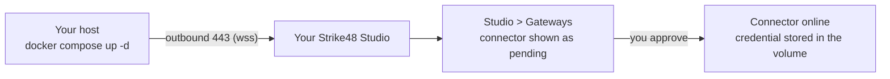

# Pick Connector - Docker Install Guide

Run the Pick connector as a single Docker container on a host inside your
network, connect it outbound to your Strike48 Studio, and approve it in Studio.
Install takes about ten minutes on a host that already has Docker.

This guide assumes you can open a terminal on a Linux machine and run
commands, and nothing more. You do not need to know Docker.

**Use a Linux host.** A Linux server or virtual machine with Docker Engine,
sitting on the network you want to test, is the supported setup and the only
one where every scan type works. Docker Desktop on Windows or macOS runs the
container behind its own virtual machine, so it cannot see your local network.
If Windows is all you have, read
[Docker Desktop on Windows](#docker-desktop-on-windows) first to see what it
cannot do.

**The short version:** install Docker, download the files, run the preflight
check, fill in four values, start the container, and approve it in Studio.
Steps [0 to 7 under Install](#install) walk through each one, with the output
you should see after every command. Then work through
[Before your first scan](#before-your-first-scan): a connector that shows as
online in Studio can still be unable to see the network you want to test.
To have an AI coding agent do the install with you, see
[Install with an AI coding agent](#install-with-an-ai-coding-agent).

## Choose your setup

Pick the row that matches the machine that will run the connector:

| Machine | Use | Why |
| --- | --- | --- |
| A Linux server or virtual machine on the network you will test | **Docker, with this guide** | The container reaches the network through the host, and host networking gives it the host's own interfaces for discovery scans |
| A Windows or macOS laptop | **The native Pick app** from the [releases page](https://github.com/Strike48-public/pick/releases) | Docker Desktop runs containers in a virtual machine. Its host networking is layer 4 only, so ICMP, ARP, mDNS, packet capture and Wi-Fi scans cannot reach your network |
| A Windows laptop, where TCP scans of routed hosts are enough | Docker Desktop, with [Docker Desktop on Windows](#docker-desktop-on-windows) | Works for TCP connect scans; local discovery does not |

If you are not sure, the preflight check in [step 2](#2-check-the-host)
tells you what your host can do.

## Downloads

| What | Where |
| --- | --- |
| Docker image | `ghcr.io/strike48-public/pick:0.1.11` ([package page](https://github.com/orgs/Strike48-public/packages/container/package/pick)) |
| Install files for this version | [Pick v0.1.11 release](https://github.com/Strike48-public/pick/releases/tag/v0.1.11), assets `pick-docker-compose.yml` and `pick-docker.env.example` |
| Preflight check and agent runbook | the same release, assets `pick-docker-preflight.sh` and `pick-docker-agent-setup.md` |
| Newest release | [github.com/Strike48-public/pick/releases/latest](https://github.com/Strike48-public/pick/releases/latest) |

You do not pull the image by hand; step 4 does it for you. Use the version
number, not `latest`: the `latest` and `main` tags on the image are
development builds that have not been released. If the newest release is
newer than `0.1.11`, check with your Strike48 contact that it is approved for
customer use, then use its number in step 1.

## What you are installing

The connector is one container built on Kali Linux that bundles the
penetration-testing toolchain (nmap, nikto, nuclei, ffuf, sqlmap, and more) and
the `pentest-agent` binary. It opens one outbound TLS connection to your Studio
on port 443 and keeps it alive. At start and on each credential refresh it also
makes a short HTTPS call to your Strike48 authentication host, on 443. Nothing
dials in to you.

Because the connection is outbound only, you do not open a firewall port,
publish a hostname, or place the container in a DMZ. The host needs Docker and
egress to two hostnames on 443: your Studio and your authentication host.

On first start the connector registers with your tenant in a pending state and
carries no authority until someone with Gateways permission in your Studio
approves it. Strike48 staff cannot approve it for you.


```mermaid
flowchart LR
  A["Your host<br/>docker compose up -d"] -->|"outbound 443 (wss)"| B["Your Strike48 Studio"]
  B --> C["Studio > Gateways<br/>connector shown as pending"]
  C -->|"you approve"| D["Connector online<br/>credential stored in the volume"]
```

## Before you begin

### What Strike48 gives you

1. Your **Studio URL**, for example `https://studio.example.com`. The connector
   uses the same hostname you open in a browser.
2. Your **authentication hostname**, for example `auth.example.com`. You do not
   configure it anywhere; Studio hands it to the connector at approval. You need
   it only to allow egress.
3. Your **tenant UUID**, a value shaped like `0192a7c4-3f5e-7b21-9d4a-6e8f0c1b2a3d`.
   It is an identifier rather than a secret, but treat it as internal. If you
   can sign in to Studio, you can also copy it yourself: open **Gateways**, and
   it is shown in the **Tenant** badge under the page title
   **Gateway Configuration**.
4. Optionally, a **registration token** (`ott_...`) if you want the connector
   pre-approved instead of approving it by hand. Tokens are single-use and
   expire fifteen minutes after they are issued.

There is no registry login. The image is public.

### What the host needs

On the host that will run the connector:

| Requirement | Minimum | How to check |
| --- | --- | --- |
| Docker Engine | a current release (this guide was tested with 29.5) | `docker --version` |
| Docker Compose | v2 plugin (`docker compose`, not the 1.x `docker-compose`; tested with 5.5) | `docker compose version` |
| Outbound HTTPS to Studio | 443 to your Studio hostname | `curl -sS -o /dev/null -w '%{http_code}\n' https://<your-studio-host>/` prints `302` or `200` |
| Outbound HTTPS to authentication | 443 to your Strike48 authentication hostname | `curl -sS -o /dev/null -w '%{http_code}\n' https://<your-auth-host>/` prints a 2xx or 3xx code |
| Outbound HTTPS to the image registry | 443 to `ghcr.io` and `pkg-containers.githubusercontent.com`, which serves the image layers | `docker pull ghcr.io/strike48-public/pick:0.1.11` |
| Outbound HTTPS to GitHub, install time and at run time | 443 to `github.com` and `release-assets.githubusercontent.com`, which the release download redirects to; nuclei downloads its templates from GitHub at run time (see [What leaves your network](#what-leaves-your-network)) | the `curl` commands in step 1 succeed; nuclei template updates work |
| Disk | 8 GB free | `df -h /var/lib/docker` (the `0.1.10` image is about 1.2 GB to download on arm64 and 1.4 GB on amd64, and about 5 GB once unpacked) |
| Memory | 2 GB (recommended floor), 4 GB comfortable | `free -h`. Guidance, not a measured minimum. Measured with the `0.1.10` image against one web target: a full-port nmap scan with version detection peaked at 42 MB, and nuclei with its default templates at about 850 MB, including its first template download. Tools the agent runs in parallel add up, and nuclei grows with concurrency and target count |
| CPU | 2 vCPUs or more | `nproc`. Not a hard minimum; scans take longer on fewer cores |
| Clock | synchronised by NTP or your hypervisor's time sync | `timedatectl` shows `System clock synchronized: yes`. See [Keep the clock in sync](#keep-the-clock-in-sync) |
| Privileges | member of the `docker` group, or root | `docker ps` |
| Architecture | linux/amd64 or linux/arm64 | `uname -m` |
| Local-network discovery | a Linux host running Docker Engine. Docker Desktop on Windows or macOS supports TCP connect scans of routed hosts only; see [Docker Desktop on Windows](#docker-desktop-on-windows) | `uname -s` on the host prints `Linux`. On Windows or macOS, Docker runs in a virtual machine whichever product you use (Docker Desktop, Colima, and others), with similar network limits |

The host does not need a public IP, an inbound DNS record, or a certificate of
its own. If your egress goes through an HTTP proxy or a TLS-inspecting
appliance, read [Corporate proxy and private CA](#corporate-proxy-and-private-ca)
before you start.

## Install

Run the steps in order, one command at a time, and compare each result with
the output the step shows before you go on. If you use an AI assistant to help,
ask it to do the same: running several steps at once hides the one that failed.

### 0. Install Docker

Skip this step if `docker compose version` already prints a version.

1. Install Docker Engine for your Linux distribution by following Docker's
   own instructions at
   [docs.docker.com/engine/install](https://docs.docker.com/engine/install/).
   They install the Compose plugin as well.
2. Let your user run Docker without `sudo`, as described in
   [Docker's post-install steps](https://docs.docker.com/engine/install/linux-postinstall/):

   ```bash
   sudo usermod -aG docker $USER
   ```

   Log out and back in so the change takes effect.
3. Confirm both commands print a version and that `docker ps` runs without a
   permission error:

   ```bash
   docker --version
   docker compose version
   docker ps
   ```

   Expected output. Your version numbers will differ; the `docker ps` header
   line with no rows under it means Docker works and nothing is running yet:

   ```
   Docker version 29.8.1, build 4a63305
   Docker Compose version v5.5.1
   CONTAINER ID   IMAGE     COMMAND   CREATED   STATUS    PORTS     NAMES
   ```

   `permission denied while trying to connect to the Docker daemon socket`
   means the log out and back in has not happened yet.

Membership of the `docker` group is equivalent to root on that host, so only
add users who should have it.

### 1. Get the bundle

Four files: a compose file you do not edit, an environment template you copy,
a preflight check script, and a runbook for an AI coding agent. All four ship
as assets of the release you are installing, so the bundle, this guide, and
the image are pinned to the same version. `0.1.11` is the release approved for
customer use.

```bash
PICK_VERSION=0.1.11
mkdir pick-connector && cd pick-connector
base="https://github.com/Strike48-public/pick/releases/download/v${PICK_VERSION}"
curl -fsSL "$base/pick-docker-compose.yml" -o docker-compose.yml
curl -fsSL "$base/pick-docker.env.example" -o .env.example
curl -fsSL "$base/pick-docker-preflight.sh" -o preflight.sh
curl -fsSL "$base/pick-docker-agent-setup.md" -o AGENT_SETUP.md
chmod +x preflight.sh
ls -a
```

Expected output. The `curl` commands print nothing when they succeed, and
`ls -a` lists the four files:

```
.  ..  .env.example  AGENT_SETUP.md  docker-compose.yml  preflight.sh
```

`curl: (22) The requested URL returned error: 404` means that version number
has no such file; check `PICK_VERSION` against the releases page.

The compose file from a release defaults to that release's image tag, so you
do not set the tag anywhere. The source of all four files is
[`deploy/docker/`](../deploy/docker/) in this repository; the release copy of
the compose file differs only in that default.

Run every `docker compose` command in this guide from inside this
`pick-connector` folder. Compose finds the connector by the files in the
current folder, so the same command run elsewhere fails with
`no configuration file provided: not found`.

### 2. Check the host

The preflight script checks what makes a first install fail: the Docker
version, the host architecture, outbound connections to Studio, your
authentication host and the image registry, internal DNS, reachability of a
target, and whether Docker's network overlaps yours. It changes nothing on the
host. Give it your Studio and authentication hostnames, and, if you have them,
one internal hostname and one known-live target with an open TCP port:

```bash
./preflight.sh --studio studio.example.com --auth auth.example.com \
  --resolve <internal-hostname> --target <known-live-ip>:<open-port>
```

Add `--discovery` if you plan mDNS, SSDP, ARP, packet capture or Wi-Fi scans.
`./preflight.sh --help` lists every option.

Expected output, ending with no failures. Each line is `PASS`, `WARN`, `FAIL`
or `SKIP`:

```
== Host and Docker
PASS  Host operating system is Linux
PASS  Docker daemon is running and your user can use it
PASS  Docker Engine 29.5.2 (Ubuntu 24.04.4 LTS)
PASS  Docker Compose 5.5.1
PASS  Architecture x86_64 is supported
PASS  84 GB free under /var/lib/docker
PASS  System clock is synchronised

== Configuration (.env)
SKIP  .env checks (no ./.env here yet)

== Outbound connections
PASS  Outbound 443 to studio.example.com (Studio) answered HTTP 302
PASS  Outbound 443 to auth.example.com (authentication) answered HTTP 200
PASS  Outbound 443 to ghcr.io (image registry) answered HTTP 301
PASS  Outbound 443 to pkg-containers.githubusercontent.com (image layers) answered HTTP 400
PASS  Outbound 443 to github.com (release downloads and nuclei templates) answered HTTP 200

== Internal names and targets
PASS  This host resolves intranet.example.com
PASS  This host reaches 10.20.0.9 port 22

== Docker networking
SKIP  Network mode (no pick-connector container yet; run preflight again after 'docker compose up')
PASS  No Docker subnet overlaps a host route or a target

15 passed, 0 warnings, 0 failed.
No blocking problems found.
```

Any HTTP code on an outbound line is a pass: it proves the connection got
through. Every `WARN` and `FAIL` line is followed by a `Fix:` line saying what
to change; fix each `FAIL` and run the script again before you go on. Run it
again at any time, for example after [step 5](#5-check-the-logs) to repeat the
network checks from inside the container.

### 3. Configure

```bash
cp .env.example .env
nano .env
```

`nano` is a simple terminal text editor; any editor you prefer works. In
`nano`, move with the arrow keys, save with `Ctrl+O` then `Enter`, and quit
with `Ctrl+X`. The file name starts with a dot, so `ls` hides it; `ls -a`
shows it.

Fill in the four required values. Everything else in the file is optional and
stays commented out unless you need it. In your editor, set:

```ini
STRIKE48_HOST=wss://studio.example.com
STRIKE48_API_URL=https://studio.example.com/
STRIKE48_TENANT=<your tenant UUID>
STRIKE48_INSTANCE_ID=pick-<hostname>-01
```

`STRIKE48_HOST` is your Studio hostname with `wss://` in place of `https://`
and no port. `STRIKE48_API_URL` is the same hostname over `https://` with a
trailing slash. `STRIKE48_INSTANCE_ID` is any stable name for this install; the
approval is keyed to it, so pick something you will not change.

**Use a different `STRIKE48_INSTANCE_ID` on every machine.** If you install on
more than one machine, for example a laptop and a lab server, do not copy the
same `.env` between them unchanged. Two connectors with the same instance id
compete for one identity in Studio, and Studio can show the connector as
offline or fail to open its app.

Save the file, then check it. With a `.env` present, preflight reads the
Studio hostname from it, so `--studio` is not needed:

```bash
./preflight.sh --auth auth.example.com
```

Expected, in the `Configuration (.env)` section:

```
PASS  .env has the four required values in the expected shapes
```

A `FAIL` here names the key that is wrong, for example
`FAIL  STRIKE48_TENANT in .env still has the example value`. Preflight never
prints the values themselves.

### 4. Start

```bash
docker compose up -d
```

The first start pulls the image, which takes a minute or two. Expected, as the
last line:

```
 Container pick-connector Started
```

In an interactive terminal the line starts with a check mark. A missing
required value aborts immediately with a message naming it, for example:

```
error while interpolating services.pick.environment.STRIKE48_TENANT:
required variable STRIKE48_TENANT is missing a value: set STRIKE48_TENANT in .env to your tenant UUID
```

### 5. Check the logs

```bash
docker compose logs --no-color
```

A successful first start ends with these lines. The instance name and tenant
are yours:

```
pentest-agent starting
  host:      wss://studio.example.com
  tenant:    0192a7c4-3f5e-7b21-9d4a-6e8f0c1b2a3d
  instance:  pick-dc1-01
  tls:       true
  auth:      ott (pending approval)
Registered 116 tools
Registering without JWT (pending approval flow)
Registered successfully: matrix:0192a7c4-3f5e-7b21-9d4a-6e8f0c1b2a3d:pentest-connector:pick-dc1-01
[status] Registered
```

`Registered` here means the connector has announced itself and is waiting. It
is not approved yet and cannot run tools.

### 6. Approve in Studio

You need a Studio account with Gateways permission for this step. If you do
not have one, send your Studio administrator the instance id you set in
`.env` and ask them to approve it.

1. Open your Studio and go to **Gateways**. The page is titled
   **Gateway Configuration**.
2. Find the **Pending Approvals** section. It is collapsed when it holds more
   than ten entries; click its heading to expand it, or type your instance id
   in the search box.
3. Find the row whose instance id matches `STRIKE48_INSTANCE_ID` in your
   `.env`. The row also shows the connector type and how long ago it
   registered.
4. Click the green check button (**Approve**) on that row, and confirm when
   Studio asks **Approve this connector?**. The red cross next to it rejects
   the connector instead.

<!-- Screenshot pending: Gateways page, Pending Approvals expanded, one pick-connector row with the Approve button highlighted. Save as docs/images/docker-install/gateways-pending.png, tenant UUID and hostnames redacted. -->

After you approve, the row is replaced by a card that says the connector is
approved and waiting to reconnect. The card disappears as soon as the
connector reconnects with its new credential, usually within a few seconds.

<!-- Screenshot pending: the same page with the connector shown as active. Save as docs/images/docker-install/gateways-active.png. -->

If the connector has not reconnected after about 20 seconds, the card turns
red and says it has not reconnected yet. That means the connector is not running or cannot reach Studio: check the logs in the next
step and the [Troubleshooting](#troubleshooting) table.

### 7. Confirm

Approval reaches the connector over the connection it already holds. Within a
few seconds the log shows:

```
Sent JWT re-registration on existing stream (no disconnect)
Registered successfully: matrix:0192a7c4-3f5e-7b21-9d4a-6e8f0c1b2a3d:pentest-connector:pick-dc1-01
```

Check with:

```bash
docker compose logs --no-color --since 5m
```

The connector is online when Studio shows it as active. From this point the
approval persists across restarts, upgrades, and host reboots, because the
credential lives in the `pick-connector_pick-state` volume. After a restart the
startup banner still prints `auth: ott (pending approval)` before the stored
credential is loaded; the `Registering without JWT (pending approval flow)`
line no longer appears, and Studio keeps showing the connector as active.

Online is not the same as ready to scan. Continue with
[Before your first scan](#before-your-first-scan) before the first engagement.

## Install with an AI coding agent

An AI coding agent such as Claude Code, run on the host, can do the install
with you. `AGENT_SETUP.md`, downloaded in [step 1](#1-get-the-bundle), is a
runbook written for the agent. Open the agent in the `pick-connector` folder
and give it this prompt:

```
Read AGENT_SETUP.md in this folder and follow it to install the Pick connector with me. Explain each command before you run it.
```

The runbook holds the agent to these rules:

- It explains each command before running it, and runs preflight first.
- It never prints or reads back `.env`. You type the tenant UUID and any
  registration token into `.env` yourself, in your own editor. Do not paste
  them into the chat.
- It stops and waits while you, or your Studio administrator, approve the
  connector in Studio.
- It confirms success from the log lines shown in steps 5 and 7.
- It never changes the pinned security values `DISABLE_SANDBOX` and
  `MATRIX_TLS_INSECURE`.
- It enables host networking or `PENTEST_ALLOW_PRIVATE_IPS` only after you
  confirm it is in your rules of engagement, and it asks before any command
  that uses `sudo` or restarts Docker.

You stay responsible for what the agent runs on your host. Read each
explanation before you let it go ahead.

## Before your first scan

The connector is online, but that only proves it can reach Studio. Work
through this section before the first engagement: it covers whether the
connector can reach and resolve your targets, the host settings that make
scans fail quietly, and the approvals you need before scanning anything.

Terms used below:

- **Host**: the machine running Docker and the connector. It can be a
  physical server or a virtual machine.
- **Bridge network**: Docker's default. The container gets a private address
  and reaches your network through the host, like a device behind a home
  router.
- **Host networking**: an optional mode where the container uses the host's
  own network interfaces directly.
- **Override file**: `docker-compose.override.yml`, a file you create next to
  `docker-compose.yml` to add settings. Docker Compose reads both files
  automatically, so you never edit the downloaded compose file.
- **Segment or VLAN**: the part of your network a set of targets sits on.
- **Private address ranges (RFC 1918)**: internal addresses starting
  `10.`, `172.16.` to `172.31.`, and `192.168.`.

### Network requirements for scanning

[What the host needs](#what-the-host-needs) covers what the connector needs
to reach Studio. Scanning has
separate requirements, and they are all properties of the Docker host: the
container reaches your targets through the host's network and resolves names
through the host's DNS configuration. If the host cannot reach or resolve a
target, neither can Pick. Run these checks on the host; they work the same
before or after the connector is installed. The preflight script from
[step 2](#2-check-the-host) runs checks 1 and 2 for you with `--target` and
`--resolve`, and once the container exists it also runs them from inside the
container and checks the network mode.

1. **The host is on the network you want to scan.** Connect it to the VLAN or
   segment in scope, and confirm it can reach a known-live target:

   ```bash
   nc -vz -w3 <known-live-ip> <open-port>
   ```

   If `nc` is not installed, bash can make the same check:

   ```bash
   timeout 3 bash -c '</dev/tcp/<known-live-ip>/<open-port>' && echo open
   ```

2. **The host resolves your internal names.** On the default network, Docker's
   embedded DNS server (`127.0.0.11` inside the container) forwards lookups to
   the DNS servers configured on the host. With
   [host networking](#enable-host-networking) the container shares the host's
   network stack. In both cases a host that points only at a public resolver
   cannot resolve internal names, and scans of those names fail. The
   in-container check at the end of this section confirms what the container
   actually resolves. On the host, confirm with an internal hostname:

   ```bash
   getent hosts <internal-hostname>
   ```

   If this fails, fix the host's DNS first (your DHCP, netplan, or
   systemd-resolved configuration). If the host must keep a different
   resolver, give the container your internal DNS servers in
   `docker-compose.override.yml`:

   ```yaml
   services:
     pick:
       dns:
         - <internal-dns-server-ip>
       dns_search:
         - <internal.example.com>
   ```

3. **Docker uses the network mode your scans need.** The Compose bridge network
   (`pick-connector_default`) is enough for TCP and UDP scans of routed hosts.
   mDNS, SSDP, ARP discovery, packet capture, and Wi-Fi scanning need host
   networking on a Linux host. See
   [Scanning your local network](#scanning-your-local-network-host-networking)
   to choose.

   | Scan type | Compose bridge | Host networking (Linux) |
   | --- | --- | --- |
   | TCP/UDP port scans of routed hosts | yes, if the bridge subnet does not overlap your LAN | yes |
   | ICMP ping sweeps | yes | yes |
   | mDNS/Bonjour, SSDP/UPnP discovery | no | yes |
   | ARP discovery, packet capture, Wi-Fi scanning | no | yes |

After the connector is running, repeat the checks from inside the container to
confirm it sees what the host sees:

```bash
docker exec pick-connector getent hosts <internal-hostname>
docker exec pick-connector nc -vz -w3 <known-live-ip> <open-port>
```

A check that works on the host but fails in the container points at the
network mode, a subnet overlap, or the container's DNS settings.

### IPv6 targets

The default network Compose creates for the connector is IPv4 only. Docker
enables IPv6 on a network only when you ask for it, and only on Linux hosts, so
an IPv6 target that the host can reach is unreachable from the container until
you do. If your scope includes IPv6 ranges, either use
[host networking](#enable-host-networking), which gives the container the
host's IPv6 addresses, or enable IPv6 on the connector's network in
`docker-compose.override.yml`:

```yaml
networks:
  default:
    enable_ipv6: true
```

Without a subnet, Docker assigns the network a unique local (`fd00::/8`)
`/64`. Recreate the network with `docker compose down` and
`docker compose up -d`, then confirm from inside the container:

```bash
docker exec pick-connector ip -6 addr show
docker exec pick-connector nc -6 -vz -w3 <known-live-ipv6> <open-port>
```

`PENTEST_ALLOW_PRIVATE_IPS=true` (see
[Scanning private address ranges](#scanning-private-address-ranges)) also
covers IPv6 unique local addresses (`fc00::/7`) and loopback. Link-local
addresses (`fe80::/10`) stay blocked for the web tools either way.

### Keep the clock in sync

At every start and credential refresh the connector signs a short assertion
stamped with the container's current time, valid for 60 seconds, and exchanges
it at your authentication host for a token. It treats a token as expired 30
seconds before its expiry time. Drift breaks this in either direction:

- **Clock ahead of the authentication host, by any amount.** Observed on a
  customer host: the authentication host allows no leeway for a timestamp in
  the future, and the log shows:

  ```
  Token request rejected (400 Bad Request): {"error":"invalid_client","error_description":"Token was issued in the future"}
  ```

- **Clock behind by more than about a minute.** The assertion has already
  expired by the authentication host's clock, and the error may not mention
  time.

When the token request fails, the connector registers without a token
(`RegisterConnectorRequest.jwt_token` is empty), so the log can still say
`Registered successfully` and the gateway can still appear in Studio while
every authenticated call fails. The connector keeps retrying on its own;
nothing is lost and no re-approval is needed once the clock is right.

Containers do not keep their own clock: they read the clock of the Docker
host, or of the Docker Desktop virtual machine on macOS and Windows. Confirm
which side is off by comparing three clocks, with your `STRIKE48_API_URL` in
place of `https://studio.example.com`:

```bash
date -u                                                  # this host
docker run --rm alpine date -u                           # the clock the container sees
curl -sI https://studio.example.com/ | grep -i '^date'   # the Studio's clock
```

If the container clock differs from the `date` header, fix the time where the
container reads it, not in the container:

- Linux host: `timedatectl` should print `System clock synchronized: yes`. If
  it does not, enable NTP (`sudo timedatectl set-ntp true`) or your
  hypervisor's guest time synchronisation. VMs that have been suspended or
  restored from a snapshot are the usual cause.
- Docker Desktop on macOS or Windows: quit and reopen Docker Desktop. Its VM
  clock drifts while the machine sleeps and resyncs when Docker Desktop
  starts.

Then run `docker compose restart`. The next token request succeeds within a
few seconds and the log shows the connector online.

### Endpoint security on the host

The image is built on Kali Linux and contains offensive security tools. An
endpoint detection or antivirus agent on the host, or on the VM, may block the
image pull, quarantine files from its layers, or stop tool processes partway
through a scan. From the connector's side that looks like a tool failing or a
scan ending early, not like a security block. Before the first engagement,
agree an exclusion for the connector with whoever runs endpoint security on
that host: for example Docker's data directory (`/var/lib/docker`) and
processes running in the `pick-connector` container. Check the endpoint
agent's own alerts first when tools fail without a clear error.

### Running Docker inside a virtual machine

If the Docker host is itself a virtual machine (for example a Linux VM on
VMware, Hyper-V, Proxmox, VirtualBox, or a cloud instance), scan traffic passes
through one more layer: the container, then the VM, then the hypervisor or
physical host, then your network. Every layer must be allowed to reach every
system you intend to test. A check that passes on the physical host proves
nothing about the VM, so run the checks above from inside the VM.

**Network access.** Give the VM itself a path to each in-scope system:

- Attach the VM's virtual network adapter to the in-scope segment, with the
  VLAN or port group that segment uses. A bridged or external-switch adapter
  puts the VM directly on that network. A NAT adapter hides the VM behind the
  physical host.
- Allow the traffic through every firewall between the VM and the targets: the
  VM's own firewall, the physical host's firewall, and for a cloud instance its
  security groups, network ACLs, and route tables.
- The VM also needs the Studio and authentication egress in the table at the
  top of [Before you begin](#before-you-begin).

**Authorization.** Targets see the scan coming from the VM's address when its
adapter is bridged, and from the physical host's address when it uses NAT. That
address is the one to record in your rules of engagement, and the one target
owners need to allowlist or expect in their firewall and intrusion-detection
logs. Prefer a bridged adapter with its own address: with NAT, the scan shares
an address with everything else the physical host sends, which makes the
activity harder to attribute. See
[Authorization and notice](#authorization-and-notice) for who else needs that
address.

**Do not clone an approved VM.** The connector's identity is its
`STRIKE48_INSTANCE_ID` in `.env` and the credential stored in the
`pick-connector_pick-state` volume. Cloning the VM, building a template from
it, or running a copy restored from a snapshot duplicates both, and two
connectors then share one identity. Clone or template the VM before the first
`docker compose up`. If a clone already exists, on the clone run
`docker compose down -v`, set a new `STRIKE48_INSTANCE_ID` in `.env`, start it
with `docker compose up -d`, and approve the new entry in Studio.

**Keep the VM running for the engagement.** A VM that is suspended, paused by
the hypervisor, or asleep on a laptop drops its connection to Studio, and any
task running at the time stalls. The connector reconnects when the VM resumes,
but check its clock (see [Keep the clock in sync](#keep-the-clock-in-sync)).

**Limits a VM adds:**

- [Host networking](#enable-host-networking) inside a VM gives the container
  the VM's interfaces, not the physical host's. Layer 2 discovery (mDNS, SSDP,
  ARP) sees only the segment the VM's adapter is attached to, and sees nothing
  of your LAN through a NAT adapter.
- Packet capture needs the virtual switch to pass traffic not addressed to the
  VM. Many hypervisors reject promiscuous mode on a virtual switch by default;
  allow it on the VM's port group if you need capture.
- Some hypervisor NAT modes, in particular user-mode NAT, do not forward raw
  packets faithfully. SYN scans and ICMP ping sweeps through them can report
  hosts as down or ports as filtered when they are not. Use a bridged adapter
  for scanning.

To see the address the VM scans from when its adapter is bridged:

```bash
ip -4 addr show
```

With a NAT adapter, the address targets see is the physical host's, not one
shown inside the VM.

### Authorization and notice

Network access is not permission. Before the first scan:

- **Record the source address.** Put the address targets will see (the host's,
  or the VM's or physical host's as described in
  [Running Docker inside a virtual machine](#running-docker-inside-a-virtual-machine))
  in your rules of engagement, next to the in-scope ranges and the test window.
- **Tell the target's security team.** Scans trigger intrusion detection,
  SIEM alerts, rate limiting, and sometimes automatic blocking. Give the
  target owner's security operations team the source address and the test
  window in advance, so the activity is recognised and the address is not
  blocked partway through the engagement.
- **Check your cloud provider's rules.** If the connector runs in a cloud
  instance, or the targets are hosted in one, the provider's penetration
  testing policy applies as well. Each provider publishes its own, and none of
  them authorises testing assets you do not own. Confirm the engagement fits
  the policy of every provider involved.

## Configuration reference

All values are read from `.env`. The compose file passes the file through and
pins the security defaults, so a value you set in `.env` for a pinned variable
is ignored.

| Variable | Required | What it does |
| --- | --- | --- |
| `STRIKE48_HOST` | yes | Studio WebSocket endpoint, `wss://<host>`. |
| `STRIKE48_API_URL` | yes | Studio HTTPS origin with trailing slash. The connector posts its registration here, overriding any callback address the Studio advertises. |
| `STRIKE48_TENANT` | yes | Your tenant UUID. |
| `STRIKE48_INSTANCE_ID` | yes | Stable identity of this install. Approval is keyed to `CONNECTOR_NAME` plus this value. |
| `CONNECTOR_NAME` | no | Gateway name shown in Studio. Default `pentest-connector`. Instances sharing a name are load-balanced as one gateway. |
| `PICK_IMAGE_TAG` | no | Image tag. Defaults to the release the compose file was downloaded from. Leave it unset so bundle and image stay one set. |
| `STRIKE48_REGISTRATION_TOKEN` | no | Pre-approval token. See [Pre-approval](#pre-approval-with-a-registration-token). Never leave it set to an empty value. |
| `HTTPS_PROXY`, `NO_PROXY` | no | Standard proxy variables, HTTP CONNECT. Lowercase spellings work too. |
| `MATRIX_TLS_CA_CERT` | no | Path inside the container to an extra CA certificate in PEM format. Added to the system roots. |
| `PENTEST_ALLOW_PRIVATE_IPS` | no | `true` lets tools target RFC 1918 and loopback addresses. See [Scanning private address ranges](#scanning-private-address-ranges). |
| `STRIKE48_TELEMETRY` | no | `0`, `false`, `off`, or `no` turns usage telemetry off. See [What leaves your network](#what-leaves-your-network). |
| `RUST_LOG` | no | Log filter. Default `info,strike48_connector=info`. |

Pinned by the compose file and not configurable from `.env`:

| Variable | Pinned to | Why |
| --- | --- | --- |
| `DISABLE_SANDBOX` | `true` | The image does not ship the in-container tool sandbox; the container is the isolation boundary. |
| `MATRIX_TLS_INSECURE` | `false` | Certificate verification stays on. Use `MATRIX_TLS_CA_CERT` for a private CA. |

## Day-to-day operations

Logs, following, with timestamps:

```bash
docker compose logs -f --timestamps
```

Restart:

```bash
docker compose restart
```

Upgrade to a newer approved release by fetching that release's compose file,
which carries the new image tag as its default. Approval survives because the
volume does:

```bash
PICK_VERSION=<new version>
curl -fsSL "https://github.com/Strike48-public/pick/releases/download/v${PICK_VERSION}/pick-docker-compose.yml" -o docker-compose.yml
docker compose pull
docker compose up -d
```

Setting `PICK_IMAGE_TAG` in `.env` also works, but then the compose file and
the image are no longer from the same release.

Stop without losing the approval:

```bash
docker compose down
```

Remove completely. The `-v` flag deletes the volume holding the credential, so
the gateway in Studio becomes an orphan; remove it there as well.

```bash
docker compose down -v
```

Move to another host: install on the new host with the same `.env`. The
credential stays in the old host's volume, so the connector registers as
pending again and needs a fresh approval. Remove the old host's container first
so two connectors do not share one instance id.

## Pre-approval with a registration token

If Strike48 or your Studio administrator issues you a registration token
(`ott_...`), the connector approves itself on first start and no one has to
visit Gateways.

1. Uncomment `STRIKE48_REGISTRATION_TOKEN` in `.env` and paste the token.
2. Run `docker compose up -d` within fifteen minutes of the token being issued.
3. After the connector is online, comment the line out again. The token is
   spent; leaving it in place does no harm but leaving the variable set to an
   empty value does, because the connector treats an empty token as a token.

## Corporate proxy and private CA

**HTTP proxy.** Uncomment `HTTPS_PROXY` in `.env` and set your proxy URL. The
connector tunnels the WebSocket and its HTTPS calls through an HTTP CONNECT
proxy and honours `NO_PROXY`. Docker itself also needs the proxy for the image
pull; configure that in the Docker daemon or the client config as your
organisation normally does.

**TLS-inspecting appliance or private CA.** Do not disable certificate
verification. Instead, give the connector your CA:

1. Put the CA certificate in PEM format next to the compose file, for example
   `corp-ca.pem`.
2. Create `docker-compose.override.yml` beside `docker-compose.yml`:

   ```yaml
   services:
     pick:
       volumes:
         - ./corp-ca.pem:/etc/pick/corp-ca.pem:ro
   ```

3. Uncomment `MATRIX_TLS_CA_CERT=/etc/pick/corp-ca.pem` in `.env`.
4. `docker compose up -d`.

Compose merges the override automatically. The CA is added to the trust store
the connector already uses, not substituted for it.

## Scanning private address ranges

The connector refuses to point its web tools at RFC 1918, loopback, and
link-local addresses by default. This is deliberate SSRF protection. An
on-premises engagement whose scope includes `10.0.0.0/8`, `172.16.0.0/12`, or
`192.168.0.0/16` needs it relaxed:

```bash
PENTEST_ALLOW_PRIVATE_IPS=true
```

Treat that change as a scope decision recorded in your rules of engagement, not
a troubleshooting step. The cloud-metadata range `169.254.0.0/16` stays blocked
regardless.

## Scanning your local network (host networking)

By default the compose file puts the container on a Docker bridge network that
Compose creates for it, named `pick-connector_default`. The container gets its
own internal subnet and reaches your network through Docker's NAT. That is
enough for the Studio connection and for TCP scans of routed hosts, but it
limits local-network discovery:

- **Multicast discovery returns nothing.** mDNS/Bonjour (`_ipp._tcp.local.`
  and similar) and SSDP/UPnP use multicast, which does not cross the bridge. On
  a bridge network these scans come back empty on every network.
- **Layer 2 discovery and Wi-Fi tools see only the container.** ARP-based host
  discovery, packet capture, and Wi-Fi scanning see the container's virtual
  interface, not the host's Ethernet or wireless adapters.
- **A subnet overlap hides targets.** If Docker assigned the bridge a range
  that overlaps your LAN (Docker's default pools draw from `172.16.0.0/12` and
  `192.168.0.0/16`, and many organisations configure `10.x` pools), traffic to
  those targets stays inside the container and every host looks down.

To check which network the container is on and what subnet it was given:

```bash
docker inspect pick-connector --format '{{.HostConfig.NetworkMode}}'
docker network inspect pick-connector_default --format '{{range .IPAM.Config}}{{.Subnet}}{{end}}'
```

### Enable host networking

Host networking puts the container on the host's own network stack, so tools
use the host's interfaces directly. This is the Compose equivalent of
`docker run --network=host`.

1. Create `docker-compose.override.yml` beside `docker-compose.yml`. If you
   already have one (for example for a private CA), add the `network_mode`
   line to the existing `pick` service instead.

   ```yaml
   services:
     pick:
       network_mode: host
   ```

2. If your targets are on private addresses (`10.x`, `172.16.x` to `172.31.x`,
   or `192.168.x`), which a local network almost always is, set this in `.env`
   as well, provided your rules of engagement cover those ranges. See
   [Scanning private address ranges](#scanning-private-address-ranges).

   ```bash
   PENTEST_ALLOW_PRIVATE_IPS=true
   ```

3. Recreate the container:

   ```bash
   docker compose up -d
   ```

   You do not need to stop the connector first. If you do stop it, use
   `docker compose down`, never `docker compose down -v`: the `-v` deletes the
   volume that holds the approval, and you would have to approve the connector
   again.

4. Confirm the mode:

   ```bash
   docker inspect pick-connector --format '{{.HostConfig.NetworkMode}}'
   ```

   This prints `host`.

5. Confirm the connector now sees the host's network:

   ```bash
   docker exec pick-connector ip -4 -brief addr
   ```

   The output lists the host's own interfaces, including the address on the
   network you want to test. Before the change it listed only a Docker address.

The approval is stored in the `pick-connector_pick-state` volume, so the
connector comes back online without a new approval. The `NET_RAW` and
`NET_ADMIN` capabilities in the compose file still apply and are still needed
for raw-socket tools.

### Before you enable it

- **Use a Linux host running Docker Engine.** On Docker Desktop for macOS or
  Windows, containers run inside a virtual machine. Docker Desktop 4.34 and
  later offers host networking as an opt-in setting, but Docker documents it as
  layer 4 only: TCP and UDP work, and protocols below them do not. ICMP, ARP,
  raw-socket scans, and Wi-Fi tools therefore still cannot reach your network
  from Docker Desktop. On a laptop, run the Pick desktop app natively instead.
- **Use a dedicated scanning host.** Host networking removes the network
  isolation between the connector and the host. The connector's internal
  model proxy listens on a loopback TCP port, which is then on the host's
  loopback interface, where other local processes can reach it. Run it on a
  host that only runs the connector.
- **Scope still applies.** Host networking gives the tools reach to every
  network the host can see. Keep targets to the scope recorded in your rules of
  engagement.

If you only need TCP scans and the problem is a subnet overlap, you can keep
the bridge instead: set `default-address-pools` in the Docker daemon
configuration (`/etc/docker/daemon.json`) to a range your network does not use,
for example:

```json
{
  "default-address-pools": [
    { "base": "172.30.0.0/16", "size": 24 }
  ]
}
```

The daemon reads this setting only at start, so restart it, then recreate the
connector's network:

```bash
sudo systemctl restart docker
docker compose down
docker compose up -d
```

Restarting the daemon stops every container on the host, so schedule it. The
`pick-connector_pick-state` volume survives `docker compose down`, so the
approval is kept. Check the new subnet with the `docker network inspect` command above.

## Docker Desktop on Windows

We recommend a Linux host instead. The connector does run on Docker Desktop
for Windows, but with much less network reach than on a Linux host. Docker Desktop runs Linux containers inside a WSL 2 virtual
machine, and Docker documents that all of that VM's network traffic goes
through NAT in Docker Desktop's backend process (`com.docker.backend`). The
container never sits directly on your LAN, and the
[host networking](#enable-host-networking) option does not change that on
Docker Desktop.

### What works and what does not

| Scan type | Docker Desktop on Windows |
| --- | --- |
| Connection to Studio, approval, tools that talk to the internet | works |
| TCP connect scans of hosts your laptop can route to | works, subject to Windows firewall and VPN rules |
| ICMP ping sweeps, raw-socket (SYN) scans | not documented by Docker; treat results as unreliable |
| mDNS/Bonjour, SSDP/UPnP, ARP discovery, packet capture, Wi-Fi scanning | does not work |

If you need local discovery from a Windows laptop, use the native Pick app for
Windows from the
[releases page](https://github.com/Strike48-public/pick/releases) instead of
Docker. It runs on the laptop's own network interfaces rather than behind
Docker's NAT; packet capture in it needs [Npcap](https://npcap.com/) installed.
For the full discovery toolset, run the connector on a Linux host on the
network you are scanning.

### Requirements

- Docker Desktop with the WSL 2 backend, running **Linux containers** (the
  default). The image is a Linux image and does not run in Windows containers
  mode.
- Windows Defender Firewall, or your endpoint security agent, must allow
  outbound traffic from `com.docker.backend`. Docker notes that host firewalls
  filter Docker Desktop traffic on that process.
- If you are on a VPN, your laptop may reach Studio but not the network you
  are scanning, or the other way round. Check both before you start.

### Install from PowerShell

The install steps above are written for a Linux shell. In PowerShell, use
these equivalents. Use `curl.exe`, not `curl`: in Windows PowerShell 5.1,
`curl` is an alias for `Invoke-WebRequest` and rejects the flags below.

```powershell
$PICK_VERSION = "0.1.11"
mkdir pick-connector; cd pick-connector
curl.exe -fsSL "https://github.com/Strike48-public/pick/releases/download/v$PICK_VERSION/pick-docker-compose.yml" -o docker-compose.yml
curl.exe -fsSL "https://github.com/Strike48-public/pick/releases/download/v$PICK_VERSION/pick-docker.env.example" -o .env.example
Copy-Item .env.example .env
notepad .env
```

In Notepad, fill in the required values and save. Make sure the file is still
named `.env`, not `.env.txt`, and save it as UTF-8 rather than "UTF-8 with
BOM". Then continue with [4. Start](#4-start); the `docker compose` and
`docker exec` commands are the same in PowerShell.

### Check your network from Windows

Run these on the laptop before you install:

```powershell
Test-NetConnection <known-live-ip> -Port <open-port>
Resolve-DnsName <internal-hostname>
```

`TcpTestSucceeded : True` means the laptop can reach the target, and a
returned address means it resolves the name. After the connector is running,
repeat the checks inside the container:

```powershell
docker exec pick-connector nc -vz -w3 <known-live-ip> <open-port>
docker exec pick-connector getent hosts <internal-hostname>
```

If the laptop check passes but the container check fails, the cause is
Docker Desktop's network path: the firewall rule for `com.docker.backend`, the
VPN, or, for names, DNS. For DNS, set your internal DNS servers with the
`dns:` override shown in
[Network requirements for scanning](#network-requirements-for-scanning).

## Troubleshooting

| Symptom | Likely cause | Fix |
| --- | --- | --- |
| You are not sure what is wrong | Any of the rows below | Run `./preflight.sh` from the `pick-connector` folder with `--auth`, and `--resolve` and `--target` for an internal name and a known-live target. Each `FAIL` comes with a fix |
| `required variable ... is missing a value` at `up` | A required line in `.env` is blank or still commented out | Fill it in and run `docker compose up -d` again |
| `Connecting to wss://...` repeats with connection errors | Egress to the Studio host on 443 is blocked, or a proxy is required | Allow outbound 443 to the Studio hostname; set `HTTPS_PROXY` |
| Approved in Studio, but the connector never comes online after a restart | Egress to the authentication host on 443 is blocked | Allow outbound 443 to the authentication hostname Strike48 gave you |
| `Invalid host URL` at startup | `STRIKE48_HOST` points at a private IP or hostname that resolves to one | Use the public Studio hostname. For a private Studio, set `PENTEST_ALLOW_PRIVATE_IPS=true` |
| Connection fails with a port in `STRIKE48_HOST` | Hosted Studios are reached on 443 only; a port copied from a development setup will not answer | Remove the port from `STRIKE48_HOST` |
| TLS or certificate errors in the log | A TLS-inspecting appliance re-signs traffic | Follow [Corporate proxy and private CA](#corporate-proxy-and-private-ca). Do not set `MATRIX_TLS_INSECURE` |
| Logs say `Registered successfully` but nothing appears in Gateways | Wrong `STRIKE48_TENANT`, so it registered against another tenant | Confirm the UUID with Strike48, fix `.env`, `docker compose down -v`, `docker compose up -d` |
| Registration fails right after start with a token in `.env` | The token expired, was already used, or the line is set but empty | Get a fresh token or comment the line out and approve by hand |
| `PENTEST_ALLOW_PRIVATE_IPS is set to an unrecognized value` warning | The variable is set to something other than `true` or `1` | Set it to `true` or comment it out |
| mDNS, SSDP, ARP, or Wi-Fi scans return nothing | The container is on the Compose bridge network, which multicast and layer 2 traffic do not cross | [Enable host networking](#enable-host-networking) on a Linux host |
| Every host in a known-live range looks down, including TCP ports you know are open | The bridge subnet overlaps your LAN, or Docker Desktop cannot reach the local network | Check the subnet as shown in [Scanning your local network](#scanning-your-local-network-host-networking); change the Docker address pool or enable host networking |
| Scans of internal hostnames fail but the same targets work by IP | The host's DNS does not resolve internal names, so the container cannot either | Fix the host's DNS, or set `dns:` in an override. See [Network requirements for scanning](#network-requirements-for-scanning) |
| The agent reports no live hosts on a network you know is up, or says a firewall is dropping ICMP | The container cannot reach or resolve the targets: wrong network mode, a subnet overlap, host DNS, or Docker Desktop's network limits. A scan that only times out is not evidence of a firewall | Run the host and in-container checks in [Network requirements for scanning](#network-requirements-for-scanning). On Windows, see [Docker Desktop on Windows](#docker-desktop-on-windows) |
| Targets are reachable from the physical host but not from the connector, and Docker runs in a VM | The VM's adapter is not on the in-scope segment, or a VM, host, or cloud firewall blocks it | Run the checks inside the VM and fix its adapter and firewall rules. See [Running Docker inside a virtual machine](#running-docker-inside-a-virtual-machine) |
| Studio shows `App not found or connector is offline` when you open the connector | The connector is not approved or not connected, or two installs share one `STRIKE48_INSTANCE_ID` | Check the Gateways page for the connector's state and for duplicate entries. Give each machine its own `STRIKE48_INSTANCE_ID`, restart it, and approve the new entry |
| `Token request rejected (400 Bad Request)` with `Token was issued in the future`, possibly after `Registered successfully` | The Docker host or Docker Desktop VM clock is ahead of the authentication host's | Compare the three clocks and fix the side that is off. See [Keep the clock in sync](#keep-the-clock-in-sync) |
| Approved, egress to the authentication host works, but authentication fails at start or reconnect | The host clock has drifted, often after a VM suspend, snapshot restore, or laptop sleep under Docker Desktop | Compare the three clocks and enable time sync, or restart Docker Desktop. See [Keep the clock in sync](#keep-the-clock-in-sync) |
| The image pull fails partway, files are missing from the image, or tools stop mid-scan with no clear error | An endpoint security agent on the host is quarantining files or stopping processes | Check that agent's alerts and agree an exclusion. See [Endpoint security on the host](#endpoint-security-on-the-host) |
| The connector goes offline, or switches between online and offline, when another VM starts | A cloned or snapshot-restored VM shares the original's instance id and credential | On the clone, `docker compose down -v`, set a new `STRIKE48_INSTANCE_ID`, start, and approve. See [Running Docker inside a virtual machine](#running-docker-inside-a-virtual-machine) |
| IPv6 targets are unreachable from the connector but reachable from the host | The connector's network is IPv4 only | Enable IPv6 or host networking. See [IPv6 targets](#ipv6-targets) |
| Studio asks you to approve the connector again after a network change | `docker compose down -v` was run, which deletes the volume holding the approval | Approve it again in Gateways. Use `docker compose down` without `-v` from now on |
| Pending for a long time | Nobody has approved it | Expected. Someone with Gateways permission in your Studio must approve |
| Container restarts in a loop | Malformed `.env` | `docker compose logs`, fix, `docker compose up -d` |

When contacting Strike48 support, include the output of `docker compose ps`
and the last fifty log lines. Redact your tenant UUID if you are sending over
an untrusted channel.

## What leaves your network

- **To your Studio, over the connector's connection.** The AI agent that
  plans the engagement runs in Studio; the connector holds no model. Studio
  sends the connector tool requests, and the connector sends back the output
  of each tool run: discovered hosts, open ports, service banners, HTTP
  responses, findings, and evidence. Returning that output is the connector's
  purpose, so it is not filtered beyond the redaction below. It is stored in
  your tenant in Studio; ask Strike48 about retention and data location.
- **Redaction before it is sent.** The connector replaces credential-shaped
  values it recognises, such as authorization headers, tokens, and passwords,
  in the commands it records and in evidence. This is pattern matching, so a
  secret in a format it does not recognise can still be sent. Do not put
  credentials in a target description or scope note.
- **To your authentication host.** The signed assertion and the short-lived
  token exchange described in [Security notes](#security-notes). No scan data.
- **Usage telemetry.** The connector's code includes optional, pseudonymous
  usage telemetry (an install id, platform, and event names; no targets,
  commands, or results). The `0.1.11` image is built without a telemetry
  endpoint, so it sends none. To keep it off in any build, set
  `STRIKE48_TELEMETRY=0` in `.env`.
- **Tool data.** Some tools fetch their own data at run time. nuclei downloads
  its templates from GitHub the first time it runs, so it needs outbound HTTPS
  to GitHub, or it has no templates to run.

## Security notes

- The container runs as root with the `NET_RAW` and `NET_ADMIN` capabilities so
  that nmap and similar tools can open raw sockets. It has no published ports.
  With [host networking](#enable-host-networking) enabled it shares the host's
  network stack instead of an isolated bridge.
- The connector holds no long-lived bearer token. At approval it stores a
  client identity and a private key in the `pick-connector_pick-state` volume,
  under `/root/.strike48/credentials/` and `/root/.strike48/keys/`, both mode
  0600. At every start it signs a short assertion with that key and exchanges
  it at your authentication host for a short-lived JWT. Back that volume up if
  you want to survive a host rebuild without re-approval.
- `.env` contains no secret unless you add a registration token. Comment the
  token out once the connector is online.
- The connector posts its registration only to the origin in
  `STRIKE48_API_URL`. If the Studio advertises a different callback address,
  the connector logs the override and uses yours.

## How this guide was tested

The install, approval, restart, and removal steps in this guide were executed
against a live Strike48 Studio with the `0.1.10` image, and the log lines shown
are what that run printed. The proxy and private-CA sections describe behaviour
read from the connector's source and were not exercised against an appliance.
The network requirements (including IPv6, clock, endpoint security, virtual
machine, and authorization), host networking, Docker Desktop on Windows, and
what-leaves-your-network sections describe Docker's and hypervisors'
documented behaviour, the connector's source, and operational guidance; they
were not exercised in that run. The memory figures were measured separately
against a single test target. The Studio steps in
[6. Approve in Studio](#6-approve-in-studio)
were written from the source of Studio's Gateways page, not from a new live
run. The preflight check was run on a Linux Docker Engine 29.5 host, healthy
and then with each fault injected (public-only DNS, blocked Studio egress, a
Docker subnet overlapping a route and a target, the container on the bridge
with discovery requested, and Compose 2.2.3); the preflight output in
[step 2](#2-check-the-host) is representative of that healthy run. The
`docker compose up -d` line was captured from Compose 5.5.1. The agent runbook
was followed twice by a fresh agent on a Linux Docker host up to
`docker compose up`, and the problems those runs hit were fixed; the steps
after it have not yet been run by an agent against a live Studio. The files this guide
refers to
live in this repository under [`deploy/docker/`](../deploy/docker/).

## Getting help

- Strike48 support: your Strike48 contact.
- Repository: https://github.com/Strike48-public/pick
