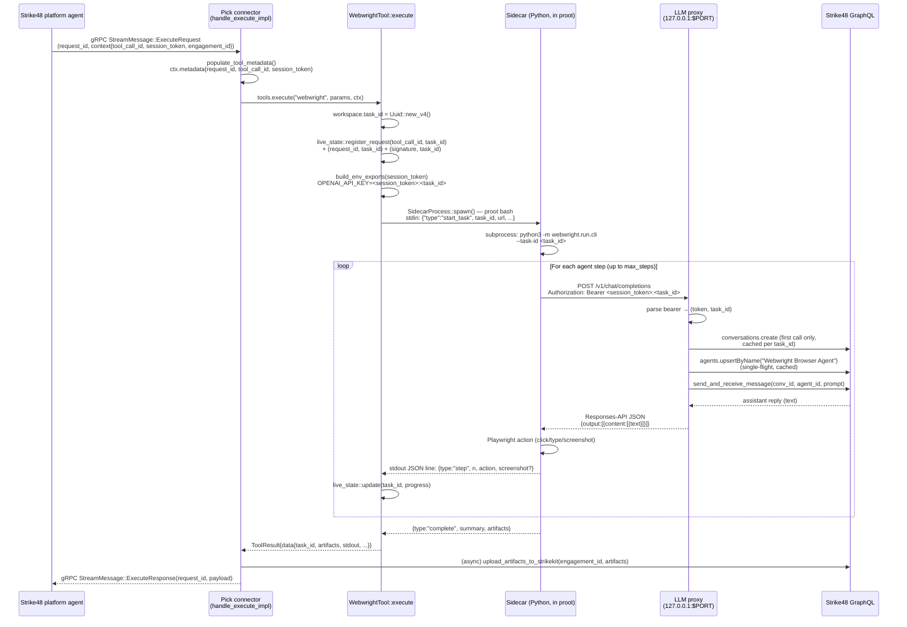

# Webwright Request Flow

**Audience:** Engineers changing webwright, the LLM proxy, or anything that
touches `ExecuteRequest.context`.

**Code anchors:**

- `crates/ui/src/liveview_connector/tools.rs::handle_execute_impl`
- `crates/tools/src/webwright/mod.rs::WebwrightTool::execute`
- `crates/tools/src/webwright/sidecar.rs::SidecarProcess::spawn`
- `crates/tools/src/webwright/sidecar_server.py`
- `crates/ui/src/liveview_connector/llm_proxy.rs::handle_llm_request`
- `crates/tools/src/webwright/live_state.rs`

---

## TL;DR

Strike48 dispatches a `webwright` tool call to Pick over a gRPC stream. Pick
spawns a Python sidecar inside a `proot` sandbox; the sidecar drives a
Playwright browser and, for every "what should I do next" decision, posts to an
OpenAI-compatible endpoint at `http://127.0.0.1:$PICK_LLM_PROXY_PORT/v1`. That
endpoint is hosted **inside Pick** (`llm_proxy.rs`) and forwards the prompt as
a conversation message back to the same Strike48 instance that started the
tool call. The reply travels back through the proxy to the sidecar, which
turns it into the next Playwright action. So a single `webwright` invocation
opens a request cycle that re-enters Strike48 dozens of times before the
ExecuteResponse goes out.

---

## Sequence

---

## Why is this shaped this way?

Webwright is a third-party browser-driving agent (Microsoft's `webwright` Python
package) that expects to talk to an OpenAI-compatible chat endpoint. We do not
control its loop or its prompt format. The only place we get to inject Strike48
into webwright's decision-making is by being the LLM endpoint it calls.

So the proxy exists for one reason: **adapt webwright's OpenAI Responses-API
shape to a Strike48 conversation, and use the user's session token to do it.**
The cycle (Strike48 -> Pick -> sidecar -> Pick proxy -> Strike48) is not an
architectural choice we made; it's what falls out of letting a third-party
agent be steered by Strike48 conversations while also being launched by a
Strike48 tool call.

Two consequences worth knowing:

1. **Authentication is delegated, not impersonated.** The session token that
   the platform sent down in `ExecuteRequest.context["session_token"]` is the
   same token the sidecar's LLM calls are authenticated with. Pick does not
   mint anything — it just plumbs the token from gRPC context into the
   sidecar's `OPENAI_API_KEY` env var, then back out as a Bearer header.
2. **Conversations are per-task, not per-connector.** Each parallel webwright
   call gets its own conversation on Strike48, keyed by the `task_id` suffix
   in the bearer token. This was a deliberate change (`feat: per-task
   conversations in LLM proxy`) — without it, parallel browsers would
   interleave their reasoning into one conversation log.

---

## Identifiers in flight

Five identifiers move through this flow. They do not all agree, and that
disagreement is load-bearing — see "Failure modes" below.

| ID                  | Created by              | Lives in                                  | What it identifies                        |
|---------------------|-------------------------|-------------------------------------------|-------------------------------------------|
| `request_id`        | Strike48 (gRPC stream)  | `ExecuteRequest.request_id`, `ExecuteResponse.request_id` | One gRPC tool-call round trip          |
| `tool_call_id`      | Strike48 agent          | `ExecuteRequest.context["tool_call_id"]`, `ctx.metadata["tool_call_id"]` | The LLM-level tool call the agent emitted |
| `toolCall.id` (`tc.id`) | Strike48 conversation API | Chat panel widget's `tc.id`            | The same tool call as seen by the conversation API |
| `task_id`           | Pick (`Uuid::new_v4`)   | `WebwrightWorkspace.task_id`, sidecar `--task-id`, result JSON, `live_state` keys | One webwright run (workspace + browser) |
| `conversation_id`   | Strike48 GraphQL        | `LlmProxyState.conversations[task_id]`    | A Strike48 conversation row               |
| `agent_id`          | Strike48 GraphQL        | `LlmProxyState.agent_id` (shared)         | The "Webwright Browser Agent" persona     |
| `signature`         | Pick (FNV hash)         | `live_state` registry key, widget lookup  | `(tool_name, canonical_args_json)` content hash |

The widget-binding triple-register in `WebwrightTool::execute` exists because
`tool_call_id` (the platform-claimed ID) and `tc.id` (the conversation-API ID)
**do not always agree** across platform versions. Pick registers the live-state
mapping under three keys (`tool_call_id`, `request_id`, `signature`) so that
the chat-panel widget can find its task however its `tc.id` was assigned. The
signature fallback is the safety net: both Pick and the widget hash
`(tool_name, sorted-key JSON args)` and look up the task under that hash, so a
widget can find its live stream even when every platform ID disagrees.

The bearer-token format `"<session_token>:<task_id>"` is parsed by
`rsplit_once(':')` in `llm_proxy.rs`. The task_id half is only accepted if it
looks UUID-shaped (>=32 chars and contains `-`); otherwise the entire string is
treated as the token. Watch out for this when the platform someday issues
non-UUID tool-call IDs.

---

## Failure modes

| Hop                             | What goes wrong                                       | Symptom                                                      | Where to look                                            |
|---------------------------------|-------------------------------------------------------|--------------------------------------------------------------|----------------------------------------------------------|
| gRPC ExecuteRequest -> Pick     | Stream drops mid-execution                            | `[tool] NO STREAM SENDER available for request_id=...` and the agent never gets a response | `handle_execute_impl` final `match tx_clone` |
| Pick -> sidecar spawn           | `proot` binary or rootfs missing; bwrap/proot wedge   | `Sidecar did not become ready in 10s`, falls back to one-shot subprocess | `SidecarProcess::spawn`, `try_sidecar_execution`     |
| Sidecar `--task-id` plumbing    | env_exports overwritten by hardcoded `pick-internal`  | LLM proxy rejects auth, sidecar errors with `SERVICE_UNAVAILABLE` | `sidecar.rs` (see comment about prior B2 root cause) |
| Sidecar -> proxy                | Proxy not listening (TCP bind failed at startup)      | Sidecar HTTP error; webwright agent dies on first step       | `liveview_connector/mod.rs` LLM proxy startup block      |
| Proxy auth                      | No session token in ExecuteRequest context AND no interactive iframe session | 503 from `/v1/chat/completions`, log: `no auth token available` | `handle_llm_request` token-resolution block          |
| Proxy -> Strike48               | Conversation create fails (auth, quota, network)      | 503; `LLM proxy: failed to create conversation`              | `MatrixChatClient::create_conversation`                  |
| Agent upsert race               | Two parallel tasks both creating "Webwright Browser Agent" | One create; second waits on `agent_upsert_lock`, then reads cache | `LlmProxyState.agent_upsert_lock`                  |
| Sidecar timeout                 | Webwright exceeds `timeout_secs - 10`                 | `[webwright-sidecar] timed out waiting for completion`; Cancel sent; ExecuteResponse still emits (degraded) | `try_sidecar_execution` `tokio::select!` deadline |
| Sidecar dropped early           | `try_sidecar_execution` returns before `Complete`     | Sidecar process gets SIGKILL via `kill_on_drop(true)` — no orphaned Chromium subtrees | `SidecarProcess::spawn` `.kill_on_drop(true)`        |
| Widget binding lookup           | `tool_call_id` != `tc.id` AND no `request_id` match   | Widget falls back to signature hash; if args mismatch (e.g. extra whitespace) it stalls on "initializing..." | `live_state::task_for_request`, `signature_for_call` |
| Artifact upload                 | `engagement_id` missing from context; `tx.send` succeeds but transport dropped | Silent: tool returns success, no artifacts on Strike48 (see MEMORY) | `tools.rs::upload_artifacts_to_strikekit`                |

The artifact-upload failure mode is special: `StrikeKitClient` invokes through
the same `matrix_tx` channel as ExecuteResponse, so `tx.send()` can succeed
locally while the platform never sees the invoke message. There's no
acknowledgement, so the connector logs `count` uploads that may not have
actually arrived. Treat upload counts as an upper bound.

---

## Things to know before changing this

- **Two timeouts, not one.** The user/agent passes `timeout` in seconds.
  `WebwrightTool::execute` then computes `timeout_secs = raw - 10` (min 30) and
  uses that as the sidecar deadline. The 10-second margin is so we send
  `ExecuteResponse` before the connector framework's own deadline kills the
  task and trips a circuit breaker. Don't remove it.
- **No global sidecar singleton.** Earlier versions kept a process-global
  `SIDECAR: Mutex<Option<SidecarProcess>>` for warm browser reuse. That made
  parallel `webwright` calls deadlock on each other. Now each
  `try_sidecar_execution` spawns a fresh proot subtree and relies on
  `kill_on_drop(true)` to clean up. Reusing a sidecar between tasks is a
  parallelism regression.
- **`ctx.metadata` is the only channel from platform context into the tool.**
  If you need a new piece of platform data inside webwright (or any tool), it
  has to be copied in `populate_tool_metadata` or the explicit forwarding
  block below it. The `agent_context` JSON blob is the historical escape hatch
  used for `engagement_id`.
- **`build_env_exports` is the sidecar's only configuration channel.** The
  sidecar runs inside proot and inherits almost nothing useful from the host.
  If you add a webwright config knob, plumb it into `build_env_exports` (with
  `shell_escape` — there are round-trip tests in `mod.rs` proving the
  escaping survives JWTs, backticks, and `$()`).
- **`session_token` ends up on a command line.** It is shell-escaped, but the
  full line is visible to any local process that can read `/proc/<pid>/cmdline`
  while the sidecar is alive. Acceptable for the local-developer model Pick
  ships, not acceptable on shared hosts.
- **`live_state` mutex is sync `std::sync::Mutex`, not `tokio::sync::Mutex`.**
  All call sites currently hold it for trivial map operations. Don't add
  `.await` while holding it.
- **Cleanup is deferred 60 seconds.** `live_state::complete` schedules a
  `purge_task` after a sleep so late widget polls still find the final frame.
  Tests that assert immediate cleanup will be flaky.

---

## Cross-references

- Conversation/agent client surface: `pentest_core::matrix::MatrixChatClient`
- StrikeKit invoke pipeline: `pentest_core::strikekit_client::StrikeKitClient`
- Chat panel widget rendering: `crates/ui/src/components/chat_panel/render.rs`
  (the consumer of `live_state::subscribe`)
